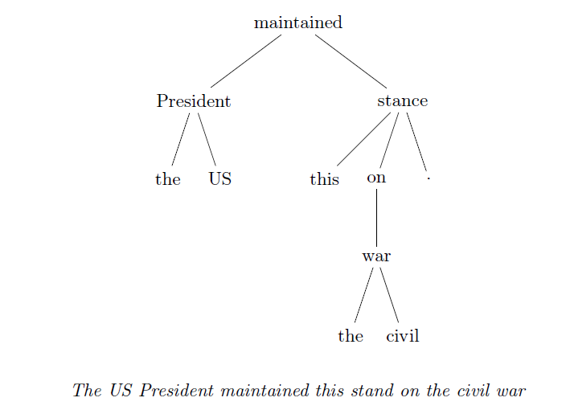
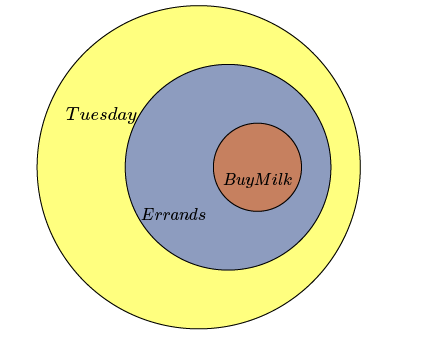

# Richer Event Description (RED) Annotation Guidelines (v.1.7)

<!-- START doctoc generated TOC please keep comment here to allow auto update -->
<!-- DON'T EDIT THIS SECTION, INSTEAD RE-RUN doctoc TO UPDATE -->
**Table of Contents**  *generated with [DocToc](https://github.com/thlorenz/doctoc)*

- [Richer Event Description (RED) Annotation Guidelines (v.1.7)](#richer-event-description-red-annotation-guidelines-v17)
  - [Introduction](#introduction)
    - [The Pipeline and General Intuitions of Annotation](#the-pipeline-and-general-intuitions-of-annotation)
    - [Acknowledgements](#acknowledgements)
- [Markables and Entity Relations Stage](#markables-and-entity-relations-stage)
  - [Event/Entity Mentions](#evententity-mentions)
    - [Finding Entities and Events](#finding-entities-and-events)
        - [What is an EVENT?](#what-is-an-event)
        - [What is an ENTITY?](#what-is-an-entity)
        - [Differentiating ENTITY and EVENT](#differentiating-entity-and-event)
      - [When many words relate to one event](#when-many-words-relate-to-one-event)
      - [When one word implies many events](#when-one-word-implies-many-events)
    - [Spans of Annotation](#spans-of-annotation)
      - [Minimum Span Annotation](#minimum-span-annotation)
    - [Annotating Features on Entities and Events](#annotating-features-on-entities-and-events)
      - [Entity Features - Polarity and Modality](#entity-features---polarity-and-modality)
      - [Event Polarity and Modality](#event-polarity-and-modality)
      - [Marking the relationship to document time (DocTimeRel)](#marking-the-relationship-to-document-time-doctimerel)
          - [DocTimeRel in relation to speech](#doctimerel-in-relation-to-speech)
      - [Event Type, Aspect and Implicitness](#event-type-aspect-and-implicitness)
      - [Annotating IMPLICITNESS of EVENTs](#annotating-implicitness-of-events)
      - [Annotating degree of EVENTs](#annotating-degree-of-events)
      - [Marking Difficult annotations](#marking-difficult-annotations)
  - [Temporal Expressions](#temporal-expressions)
    - [Identifying and Annotating TIMEX3s](#identifying-and-annotating-timex3s)
    - [Annotating TIMEX3 class](#annotating-timex3-class)
      - [DATE](#date)
      - [TIME](#time)
      - [DURATION](#duration)
      - [QUANTIFIER](#quantifier)
      - [PREPOSTEXP](#prepostexp)
      - [SET](#set)
    - [TIMEX3s vs. Temporal Manner Adverbs](#timex3s-vs-temporal-manner-adverbs)
    - [DOCTIME and SECTIONTIME Annotation](#doctime-and-sectiontime-annotation)
  - [DUPLICATE marking for repeated spans of text](#duplicate-marking-for-repeated-spans-of-text)
      - [Guidelines for finding DUPLICATE text](#guidelines-for-finding-duplicate-text)
  - [Entity Coreference Relations](#entity-coreference-relations)
    - [IDENTITY and APPOSITION of ENTITIES](#identity-and-apposition-of-entities)
    - [WHOLE/PART](#wholepart)
    - [SET-MEMBER](#set-member)
    - [BRIDGING](#bridging)
    - [General Guidelines for Entity Coreference](#general-guidelines-for-entity-coreference)
      - [Never link EVENTs to ENTITIES (except with BRIDGING)](#never-link-events-to-entities-except-with-bridging)
      - [WHOLE/PART, SET/MEMBER, and BRIDGING relations are inherited by IDENT](#wholepart-setmember-and-bridging-relations-are-inherited-by-ident)
      - [GENERIC and HYPOTHETICAL entities only corefer to entities of the same modality](#generic-and-hypothetical-entities-only-corefer-to-entities-of-the-same-modality)
      - [Email addresses and Usernames usually count as IDENT](#email-addresses-and-usernames-usually-count-as-ident)
      - [Use BRIDGING if an IDENT link is uncertain in the document (even if you know the truth)](#use-bridging-if-an-ident-link-is-uncertain-in-the-document-even-if-you-know-the-truth)
      - [Extremely broad categories (like "everyone" or "humanity") don't get SET/MEMBER](#extremely-broad-categories-like-everyone-or-humanity-dont-get-setmember)
      - [However, link generic "you" or generic "one" instances into an IDENT chain](#however-link-generic-you-or-generic-one-instances-into-an-ident-chain)
- [Event Relations Pass: Linking Events Together](#event-relations-pass-linking-events-together)
  - [General Approach to TLINK annotation](#general-approach-to-tlink-annotation)
    - [Narrative Containment](#narrative-containment)
    - [Temporal Containers vs Subevent Containers](#temporal-containers-vs-subevent-containers)
    - [Causation and Precondition Annotation](#causation-and-precondition-annotation)
  - [Rules for actually assigning TLINKS](#rules-for-actually-assigning-tlinks)
    - [Choosing the Anchors of Narrative Containers](#choosing-the-anchors-of-narrative-containers)
    - [Events should have a single container whenever possible](#events-should-have-a-single-container-whenever-possible)
    - [Avoid Redundant causation annotation -- think in terms of chains of causation](#avoid-redundant-causation-annotation----think-in-terms-of-chains-of-causation)
    - [Don't mark temporal order relations (BEFORE) if they are implied by the DocTimeRel](#dont-mark-temporal-order-relations-before-if-they-are-implied-by-the-doctimerel)
    - [Do not link TIMEX3s to one another.](#do-not-link-timex3s-to-one-another)
    - [Only link GENERIC events to other GENERICS, HYPOTHETICAL to other HYPOTHETICALs](#only-link-generic-events-to-other-generics-hypothetical-to-other-hypotheticals)
    - [Sources of information are generally not part of a causal chain](#sources-of-information-are-generally-not-part-of-a-causal-chain)
    - [Assume the writer of the text is reliable](#assume-the-writer-of-the-text-is-reliable)
    - [Causation relations to ENTITIES with implicit EVENTS must reference the EVENT](#causation-relations-to-entities-with-implicit-events-must-reference-the-event)
    - [EVENTs may participate in many ordering links, many causal links, but should only have one CONTAINS relation](#events-may-participate-in-many-ordering-links-many-causal-links-but-should-only-have-one-contains-relation)
    - [ALINKs trump causation](#alinks-trump-causation)
  - [How distant can relations be?  How explicit does the evidence need to be?](#how-distant-can-relations-be--how-explicit-does-the-evidence-need-to-be)
    - [TLINK all explicitly stated temporal relations.](#tlink-all-explicitly-stated-temporal-relations)
    - [Temporal and Subevent Containers have no locality constraints](#temporal-and-subevent-containers-have-no-locality-constraints)
    - [Don't mark temporal order (BEFORE, BEGINS-ON, etc) based purely on inference - you need evidence in the text](#dont-mark-temporal-order-before-begins-on-etc-based-purely-on-inference---you-need-evidence-in-the-text)
      - [Nearby sentences or coordinated clauses count as "evidence", but only if you can add an explicit "then"](#nearby-sentences-or-coordinated-clauses-count-as-evidence-but-only-if-you-can-add-an-explicit-then)
    - [Do causation links between coordinated clauses / adjacent sentences if they allow a so/thus/therefore paraphrase](#do-causation-links-between-coordinated-clauses--adjacent-sentences-if-they-allow-a-sothustherefore-paraphrase)
    - [Causation from non-explicit, inferrable contexts should be left out unless extremely certain](#causation-from-non-explicit-inferrable-contexts-should-be-left-out-unless-extremely-certain)
    - [Causal relations can cross sentence boundaries](#causal-relations-can-cross-sentence-boundaries)
    - [Temporal order (Non-causal, non-CONTAINS) relations only leave the sentence in specific circumstances](#temporal-order-non-causal-non-contains-relations-only-leave-the-sentence-in-specific-circumstances)
  - [Definitions and Prototypes of the TLINK sub-types](#definitions-and-prototypes-of-the-tlink-sub-types)
    - [BEFORE](#before)
    - [CONTAINS](#contains)
    - [CONTAINS-SUBEVENT](#contains-subevent)
    - [OVERLAP](#overlap)
    - [BEFORE/CAUSES, OVERLAP/CAUSES, BEFORE/PRECONDITIONS and OVERLAP/PRECONDITIONS](#beforecauses-overlapcauses-beforepreconditions-and-overlappreconditions)
    - [BEGINS-ON](#begins-on)
    - [ENDS-ON](#ends-on)
    - [SIMULTANEOUS](#simultaneous)
    - [BEFORE/PRECONDITIONS](#beforepreconditions)
    - [BEFORE/CAUSES](#beforecauses)
    - [OVERLAP/CAUSES](#overlapcauses)
    - [Annotating TLINK Features](#annotating-tlink-features)
      - [Annotating polarity of TLINKs](#annotating-polarity-of-tlinks)
      - [Annotating contextual modality of TLINKs](#annotating-contextual-modality-of-tlinks)
  - [Event Coreference](#event-coreference)
    - [IDENTITY](#identity)
    - [SET-MEMBER](#set-member-1)
    - [BRIDGING](#bridging-1)
    - [General Guidelines for Annotating Coreference](#general-guidelines-for-annotating-coreference)
      - [Never link EVENTs to ENTITIES](#never-link-events-to-entities)
      - [SET/MEMBER, and BRIDGING relations are inherited by IDENT](#setmember-and-bridging-relations-are-inherited-by-ident)
      - [Don't link ACTUAL and GENERIC events (use SET/MEMBER or BRIDGING)](#dont-link-actual-and-generic-events-use-setmember-or-bridging)
  - [Aspectual Link Annotation](#aspectual-link-annotation)
    - [ALINK sub-types](#alink-sub-types)
  - [REP - Reporting Annotation](#rep---reporting-annotation)
- [Appendix](#appendix)
  - [Edge Case Guides](#edge-case-guides)
    - [Hard Cases in EVENT vs ENTITY distinctions](#hard-cases-in-event-vs-entity-distinctions)
    - [Hard Cases when determining Markability](#hard-cases-when-determining-markability)
    - [Complex Predicates](#complex-predicates)
    - [Distinguishing Reporting events from Hedges](#distinguishing-reporting-events-from-hedges)
    - [Edge case guidelines for Relations](#edge-case-guidelines-for-relations)
      - [Distinguishing "Cause" from "Precondition"](#distinguishing-cause-from-precondition)
  - [Allowable explicit grammatical evidence](#allowable-explicit-grammatical-evidence)
    - [Permissable Evidence for BEFORE/OVERLAP](#permissable-evidence-for-beforeoverlap)
    - [Rules for Reporting verbs implying uncertain/hedged](#rules-for-reporting-verbs-implying-uncertainhedged)
    - [Permissable Evidence for Uncertain/Hedged](#permissable-evidence-for-uncertainhedged)
  - [Theoretical Footnoes](#theoretical-footnoes)
    - [Expressing TLINK Types in Point Algebra](#expressing-tlink-types-in-point-algebra)
- [Document Revision History](#document-revision-history)

<!-- END doctoc generated TOC please keep comment here to allow auto update -->

*Developed by Will Styler, Kevin Crooks, Mariah Hamang, and Tim O'Gorman
as a synthesis of the THYME-TimeML guidelines, the Stanford Event
coreference guidelines and the CMU Event coreference guidelines. These
guidelines have been developed with substantial input from Eduard
Hovy and Teruko Mitamura at Carnegie Mellon University, Rei Ikuta
at the University of Colorado, Boulder, and benefited from the discussion
at the NAACL Events Workshop.*

## Introduction

Richer Event Description is an attempt to bring together a number
of existing and well-researched veins of document annotation into
a single representation of the events and participants in a discourse.
It is not concerned with semantic role annotation in the traditional
sense – the relationships between events and the entities participating
in them – but rather the hierarchical structure of events, of time,
and of participants, and the tracking of those events and participants
over a document. 

On a more concrete level, the task of Richer Event Description annotation
is to mark which units in the text should be considered to be entities,
events or times in a document, to label those units with features
such as modality, and to mark temporal, causal, event-substructural
and coreference relations between them. 

The result of this annotation can be thought of as a timeline of events
within a document – with labels for when each event occurred and
which are contained within another – and a playbill of participants,
so that every mention of an ongoing character, location, etc., might
be linked together into a continuous sense of an entity. The desired
result, in this sense, is something which would result in a rich understanding
of a document if combined with within-sentence understanding semantic
roles, and is therefore focused upon the capture of relations not
traditionally captured in semantic-role labeling tasks. 

### The Pipeline and General Intuitions of Annotation

This is an elaborate task, and each document will have many entities,
many events, and many relations between them. It is moreover an **adjudicated
task.** This means that each document will be annotated by two people,
and disagreements between those two annotators are resolved.

This leads to the two-stage pipeline used for RED
annotation. The first stage in this pipeline will involve the annotation
of events, entities, and the coreference and partial-coreference relationships
between entities. Those annotations are then adjudicated by a third
annotator, who makes a judgement call on all disagreements. The second
stage of annotation marks the relationships between events – both
to show when those events are identical, and to mark relationships
between related events – over those adjudicated events.

The structure of such a pipeline is to help improve the consistency
of the annotation process. It is important for annotators to think
of such a question of consistency not simply in terms of avoiding
absolute errors, but in terms of whether our annotations themselves
are clear and predictable. Because document-level annotation involves
a great deal of rich understanding of the context, and your understanding
will often vary in subtle ways from your fellow annotators, we cannot
simply annotate every relationship that you observe in the text in
a haphazard fashion. The pervasive theme to attend to in reading these
guidelines, therefore, is that we are attempting to capture the rich
"meaning" of the document while doing so consistently,
and that a wide variety of rules and strictures defined below are
designed simply for that purpose.

### Acknowledgements

The project is based on work supported by Award R01LM010090 from the
National Library Of Medicine, and by DARPA FA-8750-13-2-0045, subaward
560215 (via LDC) DEFT: Deep Exploration and Filtering of Text.
The content is solely the responsibility of the authors and does not
necessarily represent the official views of the National Library Of
Medicine, the National Institutes of Health, or the Defense Advanced
Research Projects Agency.

# Markables and Entity Relations Stage

There are two different kinds of actions done during the first stage
of annotation. One is the annotation of events, entities and times, where you will be 
differentiating what is worth keeping track of, and marking those events, entities and times
with characteristic attributes. The other annotation being done is relationships between entities
– coreference, part/whole relations, set/member relations and bridging
relations between entities.

These exist in the same stage precisely so that the annotation
of both may be done at the same time. When initally learning to annotate,
however, one is encouraged to start by annotating entities and events
first, and then adding entity coreference links. As one gains competence
at the task, you are encouraged to attempt to combine these tasks as much as possible.

## Event/Entity Mentions

### Finding Entities and Events

The first and most fundamental task in the first stage of annotation
is to label EVENT and ENTITY instances. When first annotating, one should 
thing of each such labeling act as *two* decisions: the first part being the decision
about **whether** something should be annotated, and the second part being
the decision about **what exact span of words** you should mark to designate
it. 

##### What is an EVENT?

We define an event as any occurrence, action, process or event
state which deserves a place upon a timeline, and could have any syntactic realization – as verbs, nominalizations,
nouns, or even adjectives. It is important that one make the event/non-event
determination independently of syntax; we will consider syntactic
considerations for what the span of annotation will be, but not
for whether or not to consider something to be an event at all. Instead,
at this stage you should focus on the semantic questions of what is
actually happening, asking whether the words you are considering constitute
a sequence of changes, transitions or states occurring in the world
(or some possible world). 

This may be contrasted with verbs and nouns that amount of a purely
grammatical encoding to relationships between elements. For verbs,
many of the non-eventive cases will therefore be grammaticalized verbs
such as **go**, **seem**, **have**, etc. – for example, there
is only one EVENT in the sentence below:

- Your dog *seems to have eaten* the cupcakes.

In a more general sense, one can think of that criterion as being
about distinguishing whether a particular mention (like "have"
or "seems" above) constitutes its own event, or merely helps constitute the
description of a single event. For example, a light verb construction like "take
a bath" does not constitute a separate "take" event and "bath"
event, but rather combine to jointly signal the bath-taking event. 

A second definitional question emerges with states and properties.
Consider the range of circumstances below ,ranging from very eventive to not eventive at all:

- The walls *yellowed* during the fire.  (most eventive)
- We came home to find the door *opened*.
- We came home to find the door *open*.
- I own a *yellow* canary   (very non-eventive)

Hopefully the reader will agree that the last example is dramatically
less "eventive" than the other instances. Yet naturally, all states
**exist** on a timeline, so mere existence on a timeline is not
sufficient for this. However, the first two examples above do more than potentially have starts and ends; the 
mention itself implies, to many readers, an event initiating the start of the attribute.

Adjectives used as mere specifiers, to label or refer to particular
people, should therefore be viewed with skepticism in this regard. "I came home and saw
the door was open" evokes an act of someone opening it; "He walked through
the open door" does not. In short:

> An Attribute is an EVENT when its use implies actual occurrences – such as the events leading up to its own existence. 

The second kind of attribute that needs to be annotated as an EVENT are attributes that don't, themselves, pass this test, but which are clearly coreferential with those that do, or which could have SET/MEMBER relationships with those that do.

##### What is an ENTITY?

For ENTITY annotation, we will be going through the text, finding
all instances of things that constitute an ENTITY – a participant,
location, organization, or other entity that might be tracked in the
discourse. 

Just like when finding events, you must first decide if there is one
entity being mentioned or many. This can be a nuanced decision; consider our various "hospital" descriptions for edge cases:

- **[Entity Boulder County Hospital]** said that **[Entitymost]** of **[Entitythose ]** seriously wounded now were treated at an emergency
**[Entity unit]** at the **[Entity hospital]**.
- The county **[Entity hospital]** said that **[Entitymost]** of **[Entitythose ]** seriously wounded now were treated at an emergency
**[Entity unit]** at the **[Entity hospital]**.

This gets at the first two very important distinctions we are making, namely:

> If a proper name contains words that might also refer to other objects in  the discourse, do not "nest" such mentions; proper names can be treated as inseparable units. 

The second rule is:

> If an entity reference contains a word that is merely clarifying the mention, but not an entity itself, then do not mark it, such as "county" in the mention above.  The exception to this is if that word is coreferential to a "real" mention of the same thing – that is, if "the county" was mentioned and clearly referential later in the document – then come back and tag this.

There is a special case of this, however, for instances like "Manokwari Hospital" below:

- The nearest **[Entity Manokwari]** **[Entity Hospital ]** said that **[Entitymost]** of **[Entitythose ]** seriously wounded now were treated at an emergency **[Entity unit]** at the **[Entity hospital]**.

This is a separate term, because:
> If a term is not part of a name, but it is a named reference to a real, unique, named entity in the world, then make it a separate entity. 

Do this even when the term is technically an adjectival pertainym, such as:

- The **[Entity Indian]** prime **[Entity minister]**

Don't go overboard, however: when the actual named entity is not being evoked itself, but merely some stereotype, origin or style of that entity, then ignore it:

- **[Entity I ]** like American **[Entity music ]**
- **[Entity I ]** like Indian **[Entityfood ]**

A good example to remember for this is that we don't want to be keeping track of the idea of "hot dog" in every mention of "hot dog stand", but if we had a document that was somehow about "hot dogs" (say, reporting a recall of bad hot dogs), then we *do* want to keep track of it.  

A more technical definition is that for "clearly referential" things, we are doing what is called *singleton annotation*, marking a referent even if it occurs only once in the document.  For less referential entities, we are abandoning singleton annotation and *only* mark an entity if it is coreferential with more important mentions.  "Less referential", in this case, means mentions that serve to clarify what you are referring to or doing (and therefore might not be being referred to themselves). 

:bangbang: *Remember that if something is subsumed by an event, make it an event!  Specifically, if a verb-object pair such as a light verb or multi-word expression collectively constitutes an event – "tell the truth", "take a bath", etc. – then do not make the object an entity!*

##### Differentiating ENTITY and EVENT

Sometimes a mention will seem like both an ENTITY and an EVENT, often being technically a "thing" that also implies the process involving that thing:

- The **revolution** has spread to Misrata
- That **text** was really funny
- I recommended **Tylenol** three times a day.

The **revolution** might be considered either a group of people or a process of revolting; the **Tylenol** might stand for the physical pills or the act of taking them. If one talked about a disease like "carcinoma" it might be viewed both as objects and processes.  These are all subject to one core rule:

> If in doubt about the EVENT/ENTITY distinction, default to EVENT.  

We will, however, get more specific than this.  Many of these, like the mentions above, look like entities.  You can often have different answers for "When was this created?" and "When does this start?", as the event they imply are usually different from the act of doing them.  In those cases, you will mark them as an EVENT, but show that they are implicit from an object, marking them with an IMPLICIT feature:

- He was **[event sentenced]** to *[duration five years]* of **[implicit-event & entity prison]**
- Make sure to eat something before your **[implicit-event & entity vitamins]**.
- **[implicit-event & entity Loperamide]** helped to calm her stomach.

Prototypically these should be events that are implied by the entity – something that happens in that location (as in the captivity state implied by "prison"), that is the traditional thing done with that entity (such as the "pill consumption" implied by "vitamins"), and so forth (see CITATION for what we are getting at here).  All IMPLICIT EVENTs should also be marked as ENTITYs, and coreference links created for both the event and the entity if applicable:

- The nearby pipe **[implicit-event & entity bomb]** disrupted the festival. The **[event explosion]** from the **[entity device]** was heard for miles. 

-  **bombevent** IDENTICAL **explosion**
-  **bombentity** IDENTICAL **device**

Be exceedingly sparing with such implicit-event annotations. For our purposes,
only use it when you are sure that a later relations phase will really
need to make reference to an entity's implied events. Otherwise, simply
annotate that entity as an ENTITY.

#### When many words relate to one event 

As mentioned in the prior section, if many words contribute to a single event or entity, we want them all to be represented by a single markable. Some of these will be relatively clear-cut, as with *light verbs*:

> John ~~took~~ a **[event bath]**.
> The burglar ~~committed~~ a heinous **[event crime ]**. 

These are most clear-cut with light verbs meeting the rule from Bonial (2014) that "the light verb plus its true predicate can often be paraphrased by a verbal form of the true predicate without loss of the core meaning of the expression. ".  In other words, "to give a lecture" is almost identical to "to lecture", "to give a look" is almost the same as "to look", etc.  For related reasons, we will also not be marking **support verb** constructions such as: 

> The **earthquake** ~~occurred~~ during the **parade**.

In real annotations, there may be more nuanced instances than this, in which it's unclear whether one is dealing with two events or one. We will list some more specific constraints below, and you are encouraged to check the examples in the [complex predicates examples in the appendix](#complex-predicates). 

**General Rules for Complex Predicates**

- If you encounter an idiom, simply mark the head verb in the idiom, and assume that the meaning of the phrase is carried by that verb. So "The chickens have **[come]** home to roost for Bush" simply has a [come], which stands for your interpretation of the coming-home-to-roost event.  (Do not mark ENTITYs in idioms unless they will later participate in a relation with something else in the document. Typically this will be a BRIDGING relation. For example, in "By hiring Mary, we'll kill two birds with one stone," you'd mark **kill** as the EVENT, and you'd also mark **stone** as an ENTITY that will later have a BRIDGING relation with **hiring**. See the **BRIDGING** section for more on this relation.) 
- Markers of epistemic status, like "seems to" or "appears to", are not events. When in doubt, you should follow the nearest case in the [Reporting vs Hedging distinctions](#Distinguishing Reporting events from Hedges) in the appendix.

####  When one word implies many events

Sometimes a single word ends up implying many events, like the two colonoscopies implied in the following sentence (the hypothetical one and the one that occurred in the 1970s): 

- Her main concern is that she does not wish to have a **colonoscopy**, which she had back in the 1970s.

This also occurs with gapping phenomena, as in **raids**:

- The **raids** in Phoenix **began** at 4am, in Denver, at 5.

We unfortunately will be annotating only one EVENT span per actual span in the context (it would be simply too complicated otherwise).  In these cases, pick the first event being implied and assume that the word refers to that first event. 

### Spans of Annotation

Once you have decided that a given phrase or word *qualifies* as an
EVENT or ENTITY, you'll need to decide what "span" (section of the
text) to annotate.

For each ENTITY and EVENT annotation, you might have found a long
phrase (or even, for EVENTs, a complex string of verbs and nouns)
which designates that concept. We will not be annotating that
entire string, but instead will designate a single
word, the syntactic "head" of the phrase, which will represent that whole idea.

Deciding whether or not a term should be one, many, or no entities or events is entirely
a semantic decision described above; the details here are merely a decision about the span which
you should mark after that. A single noun phrase can have many ENTITYs
or EVENTs (every word in "United States Olympics Organization Chairwoman"
is an ENTITY), and the fact that a word is not the head of a larger
syntactic unit *in no way* disqualifies it from separate annotation.

#### Minimum Span Annotation

One might talk about "maximum span" annotation as being everything
encompassing what you are talking about (an approach we are *not*
 using here):

- **[max-span The 7.6-magnitude earthquake** ] had the consequences of **[max-span severe damage ]** to **[max-span multiple buildings ]** *last July*

We will take the opposite approach, using a "minimum span" style of annotation in which we only mark the syntactic head of each markable. This is because capturing everything about what makes an entity an entity, or an event an event, is not only difficult, but can lead to elaborate overlapping annotations. Instead of
the kinds of annotations you see above, we will annotate everything (except proper nouns and times) using a single word,
resulting in spans such as: 

- The 7.6-magnitude **[event earthquake]** caused severe **[event damage]** to multiple **[entity buildings]** *last July*.

- The **[entity U.S.]** **[entity President ]** **[event maintained ]** his **[event stance ]** on the civil **[event war ]**.

This does not mean we are throwing this information away, but rather
that we assume this information to be recoverable. This emphasis upon
recoverability is important; we need to capture the word that lets
us "find" the rest of the phrase in question, or in other words,
the **syntactic head**. Consider a syntactic dependency tree of the above sentence in this
regard 

One might imagine that grabbing "stance" subsumes the whole bundle of dependents, "the stance on the civil war".  Grabbing "stance" in that sense essentially can be thought of as also grabbing its dependents. 

If you find syntax trees complex and scary, don't worry: All you need to do is follow some basic rules for what
we call "head finding", which generally just means that there is a word in each
phrase which is substitutable for the whole phrase.  One casual way to test this is to ask what lexical term would be used in
a repeated version of the same phrase. If you constantly talk about "John's
insatiable hunger for more donuts", one might refer to that hunger
as "his hunger", but not by "his donuts".

For verb phrases and adjective phrases this will be simple, and there
is no need to think of things in terms of **syntactic heads**
at all. You will only be annotating the verb or adjective in the phrase,
and nothing more. Thus, look at the events in the following examples
(no other parts have been annotated):

- The stock price is **stable**.
- Patient **reports** **throwing** up.
- She's **unable** to **lift** her arms.
- Since her last **surgery**, she has seemed **disoriented** and
**moody**.
- She feels slightly **weak** but has **resumed** **most** of her normal
**activities**.
- The jury **finding** was in favor of the defendant.

Note that we take the single verb or adjective even when when dealing
with a multiword predication such as "throw up". The
exception to this tendency comes from "light verbs" and "support
verbs" mentioned above, where the verb itself is ignored:

- John ~~took~~ a **eventbath**.
- The patient ~~underwent~~ **eventsurgery**.
- The burglar ~~committed~~ a heinous **eventcrime**. 

The same rules for minimal-span annotation will also apply to nouns.
Hopefully you will have some exposure to what the head of a noun phrase
is from syntactic courses, and this will be quite familiar. Start
by examining the example for participants which you desire to annotate;
say that you found the following:

- The most recent IED attack outside the Green Zone in Baghdad
- The shooting near the war-torn city
- That recision biopsy analysis of the sigmoid colon today

For each, rule out prepositional phrases and post-positional adverbs:

- The most recent IED attack ~~outside the Green Zone in Baghdad~~
- The shooting ~~near the war-torn city~~
- That recision biopsy analysis ~~of the sigmoid colon today~~

Then for each sequence of nouns, the head is the rightmost noun:

- The most recent IED **attack** ~~outside the Green Zone in Baghdad~~
- The **shooting** ~~near the war-torn city~~
- That recision biopsy **analysis** ~~of the sigmoid colon today~~

This doesn't mean that other entities and events won't be within the
spans you considered. The same examples should result in annotations such as:

- The **[eventshooting]** near the war-torn **[entity city]** 
- That recision biopsy **[event analysis]** of the sigmoid **[entity colon]** *today*

There will be two exceptions to this "minimal span" rule: proper
names and times. Proper names should be annotated with all name parts,
so that "Bill Clinton" is not "Bill **Clinton**" but rather
"**Bill Clinton**". Do not include determiners in
such terms:

- The most recent IED **attack** outside the **Green Zone** in **Baghdad**.

With such proper names, if the last term in a phrase is a generic term referring to the same thing, default to putting it into the proper name itself, even if not capitalized:

- I got a copy of **[entity Harper's magazine ]**.

Such a list of rules gives us the following heads (only showing the
nominals):

- **She** had experienced no **dizziness** until the **start**
of **chemotherapy**.

- The **Zetas'** latest **attack** resulted in the **killing**
of three Mexican **officials**.

- The **CT** showed a small rectal **abcess**.

- The long-awaited but ultimately brief **battle** outside the
**city** quelled the rebel **uprising**.

- The **patient** reports **nausea** and **vomiting**.

- **She** does note **darkness** of the **stools**.

- The **fire** quickly spread throughout the **valley**, resulting
in the **destruction** of 15 **homes**.

- Her **yelling** shocked **everybody** at the **conference**.

- **We** also discussed **some** of the **toxicities** of
fluoropyrimidine-based **chemotherapy**.

- **Levaquin** 750 mg p.o. q. day (will restart today)

Sometimes this head-finding will be difficult. For example, in clinical
texts, one might find fragmentary phrases in which prepositions have
been elided, as in "patient had CT chest pelvis". In such cases,
do feel free to attempt various paraphrases of what the phrase means,
and to pick the word that would be the head of those more full forms. 

- **[event CT ]** **[entitychest ]** **[entitypelvis ]**

### Annotating Features on Entities and Events

When you mark each entity or event, you will need to label basic features
on the events and entities. 

#### Entity Features - Polarity and Modality

The majority of ENTITYs will be of the polarity POS for "positive",
meaning that they are actual entities. This is the default value.
You will occasionally find purpose to mark an ENTITY of a NEG polarity,
indicating that the ENTITY does not exist.

- **Mr. Black**POS spoke with **us**POS about
the new **facility**POS. 

- **Cincinnati**POS doesn't have an **airport**NEG.

- **John**POS couldn't attend the **concert**POS
for lack of **money**NEG.

A related feature is Contextual Modality, which identifies whether
the entity is a specific real entity, a class of entities, etc. The
majority of ENTITYs will be ACTUAL (they refer to real, specific entities), but one may define ENTITY as being GENERIC,
HYPOTHETICAL, or UNCERTAIN/HEDGED as well. 

The most obvious kind of GENERIC entity will be references to "kinds".
Such generics in English are often bare plurals, but can be indefinites
or definites too:

- **Terrorists**GEN in the **region**ACTUAL often attack
office **buildings**GENERIC.
- The **lion**GEN is the proudest of **animals**GEN
- We do not normally recommend surgery to **patients**GEN with
a cardiac status similar to **Ms. James**ACTUAL.

One easy way to distinguish GENERIC ENTITYs from ACTUAL ENTITYs is
by "omniscient substitution". Consider "Union Leaders" in the examples
below:

- Teddy Roosevelt met with Union Leaders before writing the bill.
- Union leaders often push for tax breaks.

In the first, an omniscient person could put together a list of the
specific persons he met with and replace it with that list:

- Teddy Roosevelt met with *Samuel Gompers, John Lewis, Walter
Reuther, A. Philip Randolph, and Jimmy Hoffa* before writing the bill.

In the second, however, no such list could be made; it refers to the whole class of union leaders, and would thus be GENERIC.

Similarly, an omniscient annotator could know specific referents for
the below ACTUAL ENTITYs:

- Three unidentified **criminals**ACTUAL broke into my shed.
- Tomorrow's **participants**ACTUAL will be thrilled.
- **Vandals**ACTUAL have defaced a prominent prehistoric pictogram.

But no referents (outside of every member, past present and future,
of a generic class) could possibly be found for the below GENERIC
ENTITYs:

- **Criminals**GEN often plead "Not Guilty," even if they've
committed the crime.
- **Participants**GEN in triathlons generally experience significant
chafing.
- **Vandals**GEN should be punished severely if caught.

The complexity of that annotation will occur with entities which are
sets, but where the set has been defined provisionally in context:

- Young Denver **voters**GEN only turn out in high numbers during presidential elections.
- My senior **class**ACTUAL performed quite well on the **SAT**ACTUAL

For these, test whether you can paraphrase them using "the kind of X that Ys" without changing the meaning. For example:

- same meaning: **The kind of young people in Denver that vote**GEN only turn out in high numbers during presidential elections.
- changes meaning: **The kind of people that are in my senior class**ACTUAL performed quite well on **the SAT**ACTUAL

A third kind of option for ENTITY modality is that of HYPOTHETICAL
entities. Hypothetical entities are not just entities participating
in a hypothetical situation – all sorts of entities can be involved
in hypothetical worlds – but rather an entity that would not exist
outside of that hypothetical possible world. 

- If he did have a Mustanghypothetical, he would wreck it.

As will come up later for GENERIC vs HYPOTHETICAL events, note also
that generalizations with "if" are still GENERIC. You should test
this by whether you can paraphrase it with a true generalization instead:

- I'm not saying that
if a **couple**GEN both work stacking shelves, they should
be getting married in a supermarketGEN
> BECAUSE: This is paraphrasable with *I'm not saying that couples that work stacking shelves should get married in supermarkets*

The above example is not depicting "couples stacking shelves" as an entity which would functionally exist if certain conditions were met, but merely specifying a set of entities in the world.  Similarly you also may use UNCERTAIN/HEDGED for entities, but it follows the same constraint; it is only to be used when the actual existence of the entity is uncertain and being actively cast into doubt by the local context.

#### Event Polarity and Modality

In order to express the polarity of an EVENT, the "polarity" attribute
of an event is specified. Polarity in this schema is relatively straightforward,
and there are only two possible types: POS and NEG.

**Positive Polarity (POS)**

The first and most common polarity value used is POS. This is the
marker of positive polarity. This is used for an EVENT that did, in
fact, occur. Most events annotated are of this polarity, and this
is the default value. POS need not be specified in annotation.

- Three **attacks** occurred last week.

- Despite international **condemnation**, North Korea is now
officially a nuclear state.

- The patient has **hepatosplenomegaly**.

- PO **changes** right pterional **craniotomy**

- The patient will **continue** **treatment**.

**Negative Polarity (NEG)**

The opposite of POS, as you might guess, is NEG, which is used to
indicate that the event didn't take place, or has an otherwise negative
polarity:

- Three attacks occurred last week, but one **attack** was prevented.

- There is no **sign** of the small plane, and rescuers located
no survivors.

- Otherwise, he has not had any **nausea**, **vomiting**,
**diarrhea**, chest **pain**, **shortness** of breath, or **fever**.

- She is not **interested** in pursuing **chemotherapy** at
this time.

- The patient did not **report** **nausea**.

- A cystic duct lymph **node** is not **identified**.

In the last two, there are two EVENTs being negated. The first
is a verbal EVENT of reporting, the second is a condition. In this
case, we can negate both the reporting of nausea and the identification
of the lymph node, as neither occurred. In addition, the nausea and
lymph node aren't present. So, both EVENTs in both examples are negated.

**Actual Modality (ACT)**

Alongside Polarity, you are also marking Contextual Modality – whether or not an event is asserting things about the ACTUAL world, about GENERIC tendencies of events, HYPOTHETICAL events or UNCERTAIN events.  The majority of EVENTs are ACTUAL, having already happened or been scheduled (without hedging) to happen:

- The patient's new **tumor** is 3.5 cm from the epiglottis.

- The patient did not **report** **nausea**.

- His anterior chest rash has not **reoccurred**.

Note that ACTUAL is about whether it is a claim in the "real world", and so NEG events are usually ACTUAL as well .

**Uncertain/Hedged Modality (UNC)**

EVENTS are marked as UNCertain when we can point to some explicit
lexical or phrasal trigger that indicates some degree of uncertainty
about the reality of the EVENT. Put differently, these EVENTs are
presented with a sort of tacit claim that they're *probably*
real (unlike hypotheticals, which are explicitly irrealis), but with
a proviso from the author that they might be not be. Therefore:

> Only use UNCERTAIN/HEDGED when there is some explicit, local cue for that uncertainty within the document!  

By "local" we mean that you should not use utilize other mentions of the same event in order to  decide between UNCERTAIN or ACTUAL.  You will be allowed to make events coreferential which vary between ACTUAL and UNCERTAIN modalities, precisely because this level of certainty might vary from mention to mention.  

Some good bits of evidence for using UNCERTAIN/HEDGED are lexical or phrasal cues ("seems", "likely", "suspicious", "possible", "consistent with"),  doubtful epistemic cues ("claims", "I suspect that...", "It would seem likely that...") and accusations and charges ("She faces five counts of ....", "He is accused of ..")

Examples of good UNCERTAIN/HEDGED instances are therefore:

- Radiation levels and seismic disturbances were measured which
are consistent with nuclear **testing**.

- Fifteen missing miners, who are now widely presumed **dead**,
are still underground.

- All evidence seems to point to **kidnapping** in the disappearance
of Dr. Charles.

Note that full denial of an event, however, is "NEG ACTUAL", as the denial is in the realm of certainty, so that the following EVENTs would
*not* be marked UNC:

- She **denies**ACTUAL **vomitingACTUAL,NEG

- There is no **evidenceACTUAL,NEG of **MSACTUAL,NEG

If something is not quite negative, but close, it is almost always signaling UNCERTAIN:

- There is no concrete **diagnosisACTUAL,NEG
of **MS**UNC, POS, but given her **symptomsACTUAL,POS,
it seems extremely likely.

:bangbang: *Remember that this is for textually evidenced uncertainty. No amount of implausibility allows you to inject UNCERTAIN based upon your own opinions:*

- Yesterday, I was **[ACTUAL abducted ]** by aliens.

One specific construction is worth discussing here, and that is when an author prefaces a proposition with “I think.”  The difficulty here is that this has two different uses – in some cases, **think** is an EVIDENTIAL EVENT linking a source of knowledge (the author) to a piece of knowledge (whatever he/she thinks), but in other cases it’s a hedging device, indicating the following event is HEDGED.

When “I think” is used as a hedging device, “think” itself should not be marked as an event.  It’s merely coding the author’s weakened adherence to the truth of the proposition, like the use of “probably” or “maybe.”  For instance, in “I think the Broncos are playing in the Super Bowl,” [playing] is UNC/HEDGED and “think” is not eventive at all.

However, in cases where the author is offering an opinion, or emphasizing that he or she is the one who thinks something, [think] is an EVENT of Type EVIDENTIAL.  In a sentence like “I think it’s sad that donut shop closed,” the author isn’t saying, “The fact that the donut shop closed is probably sad but I’m not really sure” (which would be hedging).  The author is drawing attention to the fact that he/she thinks something even though the rest of the world might not think the same thing – in other words, it has less to do with truth value than with attribution, that is, linking a piece of information (the opinion) to the source (the author).

Second- and third-person uses of “think” (“you think,” “she thinks”) should always be EVIDENTIAL EVENTs – the author is attributing information to another source.

**Hypothetical Modality (HYP)**

If ACTUAL is for modality marking certain things known about the world, and UNCERTAIN is for things which are simply unknown, HYPOTHETICAL modality is for situations involving possible worlds; where the occurrence of the event (in the past or the future) is conditional upon another specific (albeit perhaps not specified) event happening. This should fit your usual intuitions about conditionals:

- If the Israelis **strikeHYP**, the US will surely be **draggedHYP**
into a larger conflict.

- Any possible **attackHYP** would draw widespread **condemnationHYP**.

- If she experiences a **feverHYP**, we will **treatHYP** **itHYP** on an outpatient basis.

It is worth noting that, in this schema, an EVENT occurring in the future does not imply that the EVENT is HYP (although most hypothetical
EVENTs will be AFTER DOCTIME); certain future events are ACTUAL.  Thus the following, though having DocTimeRel AFTER, will be ACTUAL:

- The **closeACTUAL** of Market Friday will **markACTUAL** the **endACTUAL** of Mr. Johnson's long career.

Use HYPOTHETICAL in combination with NEG only when one is considering what would happen if the lack of that event occurs, such as:

- The treaty will only hold if there are no more **attacksHYPOTHETICAL,NEG**".

In contrast, "counterfactual" contexts – in which it has been made clear that the event did not happen – are not actually hypothetical, but ACTUAL-NEG, as one is certain that they did not happen.  Mark only the fact that they did not happen using ACTUAL-NEG (*this therefore means that we will not be making hypothetical annotations of the "what might have happened" causation chains often expressed with counterfactuals, either*):

- Had they **withdrawnACTUAL,NEG** the treaty would have **heldACTUAL,NEG**.

Note that using ACTUAL-NEG in the above context is only licensed because the counterfactual construction that is mentioning the events makes it clear that they did not happen.  Any more periphrastic ways of stating facts should be left as HYPOTHETICAL:

- If they **withdrawHYP** the treaty will **holdHYP**, but they will not **withdrawACTUAL,NEG**

Here are some additional examples to solidify these patterns:

- If Will had stopped by the store, he'd have **boughtNEG/ACT** cupcakes. But he was too lazy. 

- If Will stopped by the store, he probably **pickedPOS/HYP** up cupcakes. He lacks the fortitude to resist frosting.

- Will stopped by the store, so, of course, he **boughtPOS/ACT** cupcakes. Do you want one?

- If we had added this section to the guidelines earlier, our annotator agreement would have been **betterNEG/ACT**.

**Generic Modality (GEN)**

Generic event modality is used to refer to two separate kinds of generic eventualities: generalizations and classes of events. You do not need to distinguish the two:

- In the **aftermathGEN** of most **bombingsGEN**, **tramplingGEN** is a deadly **threatGEN**.

- In New Zealand, bills must be **approvedGEN** three times by
Parliamentary **votesGEN** and then **receiveGEN** Royal **AssentGEN** from the Governor-General.

- Adjuvant **chemotherapyGEN** following **surgeryGEN** is generally **recommendedGEN** in **situationsGEN** similar to this.

- I explained that BRAF **mutationsGEN** have no predictive value
with regard to cetuximab **sensitivityGEN**.

Although HYPOTHETICAL and GENERIC may seem similar, remember that
most HYPOTHETICAL EVENTs still refer to the specific content of the
article, depend on some eventuality occurring, and make reference
to specific EVENTs on the timeline.  In contrast, GENERIC events don't require
specific reference or conditions.

This provides an excellent test for GENERIC in practice: If a sentence
would be true if copy-pasted into any contemporaneous article, note,
or text, then it is most certainly GEN. For example:

- The terrorists **fled** Jordan via the Lebanese border.

The truth of this fleeing EVENT depends on the identity of the terrorists
and the context of the article to be true or false. Thus, it is ACTUAL. Compare with:

- Terrorists often **flee** to nation-states with crumbling
governments to avoid **interference**.

This fleeing EVENT would be equally true in any article about any
terrorists, international fugitives, or even in an article about governmental
collapse. Thus, both **flee** and **interference** are GENERIC.

The hard cases will be generalizations about ACTUAL, specific people and groups, such as:

- John always eats bananas on his Grape Nuts.

- I lose whenever I play chess.

- Florida voters disappoint me every time. 

- Jill usually got good grades in high school.

When these refer to seemingly habitual events with a clear timespan, you can make them ACTUAL.  Use GENERIC for such ACTUAL entities, instead, if you can robustly and easily paraphrase it in the past and future using a "whenever X, then Y" format:

- Whenever I playGEN chess I loseGEN

- Whenever John eatsGEN Grape Nuts he usesGEN bananas

#### Marking the relationship to document time (DocTimeRel)

DocTimeRel is short for "Document Creation Time Relation", and
represents the temporal relation between the EVENT in question and
the time when the article, post or record in question was created or published
(the "document time"). 

DocTimeRel allows us to avoid the linguistic ambiguities inherent
in explicitly marking the grammatical tense of the verb (like "past",
"present", or "past perfect"), instead marking the actual
temporal relations of the event to the time when the document was
created (marked with DOCTIME in this schema). We've chosen to use
a subset of the temporal relations present in TLINK annotations.

When annotating DocTimeRel on EVENTs, remember that this is the relation
of the EVENT in question relative to the moment in time and space
when the text was written. So an event which occurs before the time
of writing would be given the BEFORE value, but an EVENT which will
occur after DOCTIME will be given the AFTER value for DocTimeRel.
Thus we see that marking DocTimeRel on the EVENT can be thought of
as a faster, easier way to temporally link the EVENT to DOCTIME (rather
than making a TLINK for every event).

One thing to keep in mind when annotating DocTimeRel is that it is
not used to mark the permanence of events. Although it is true that
a person who is dead at DocTime will also be dead for the foreseeable
future, this idea of permanence is really a property of the event
itself, in the abstract, and doesn't need to be marked explicitly.
Similarly, when doing temporal relations annotation, one need not
say that all permanent states (death, birth, some chronic, untreatable
illness) BEGIN-ON DocTime, as they will be automatically processed
later in such a way that it is clear that they persist through the
rest of the timeline.

Unlike the other EVENT attributes, DocTimeRel has no default value,
as it should be filled in individually for every event. Currently,
our schema includes four relations between the event and DOCTIME:
BEFORE, AFTER, OVERLAP, and the combined relation BEFORE/OVERLAP.

**BEFORE**

BEFORE is used where the event ended before the document itself was
written. The bracketed events below would be marked as "BEFORE"
(all other EVENTs and TIMEX3s are unmarked):

- The **[shooting]** **[shocked]** the small city.

- This is unchanged and may be related to treatment **[changes]**.

- Today's study demonstrates a marked improvement compared to
the prior 9-16-03 **[study]**.

**OVERLAP**

OVERLAP is used for events or states which are
happening or true at the time that the document was written:

- The fires **continue** to burn in the mountains, despite
today's **rain**.

- Captain Smith of the Boulder County Sheriff's office is **requesting**
that anybody with information come forward.

- The patient **continues** to do well as an outpatient.

- The patient is **alert**, **cooperative**, and **appears**
to be in no acute **distress**.

- Moderate sized retention **cyst** or **polyp** in the right
maxillary antrum again **noted**.

- She is not **interested** in pursuing chemotherapy
at this time but is **interested** in continued **surveillance**.

**AFTER**

AFTER is used where the event is scheduled or planned to begin following
the document time:

- After the fires are **contained**, residents can **return**
home.

- Thursday's planned **strike** will put **pressure** on the
University to **pay** graduate teachers a living wage.

- **Levaquin** 750 mg p.o. q. day (will **restart** today)

- The patient will **return** tomorrow for **labs** and **exam**.

- She is not interested in pursuing chemotherapy at this time
but is interested in **continued** surveillance.

It is worth pointing out that the last example
shows the interaction between DocTimeRel and ALINKs to cover the idea
of "already happening, and will now continue".

There is one specific situation which must be discussed. EVENTs with
a Contextual Modality of GENERIC will
always have a DocTimeRel of OVERLAP, as stated truths are, presumably,
true at Document Time. See the following:

- I explained that BRAF **mutations** have no predictive value
with regard to cetuximab **sensitivity**.

**BEFORE-OVERLAP**

BEFORE-OVERLAP is used where an event clearly started before the DOCTIME and **continues into and through the DOCTIME**. This often (but not always) corresponds with the use of the English present perfect tense:

- The regime has been **arresting** suspected dissidents and
shows no sign of stopping.

- The fires have **burned** for eight days now.

- The patient has **felt** quite well and his appetite has been
**good**.

- She has not **seen** a cardiologist.

- She has had no **fever**.

- Based on last Thursday's MRI, her **swelling** is mostly gone.

This is not, however, any OVERLAP mention that extends into the past (after all, nearly everything extends *a little* into the past) but rather only events that have clear and explicit encoding of being true in the past and present.  The following lists define exactly which bits of evidence are allowable for this. This need for evidence also means that multiple mentions of the same event might vary between BEFORE and BEFORE/OVERLAP, or between BEFORE/OVERLAP and OVERLAP, and that is ok.

Be sure that any time you are using BEFORE-OVERLAP, the fact that an EVENT started before DOCTIME and continues is explicitly encoded by the language of the text (rather than through your own inference or world knowledge).  [Here is a list of the kinds of things that are admissable evidence for BEFORE/OVERLAP use](#Permissable Evidence for BEFORE/OVERLAP).  While this should not be considered a closed list, other kinds of evidence for BEFORE/OVERLAP should be similarly explicit. 

###### DocTimeRel in relation to speech

When dealing with documents involving speech (as is often
the case in newswire), there can be a number of conflicting signals
about what the time of an event is.  The general rule to follow is that you are still attempting to encode to the relation of the document itself, *not to the speech event*. 

The most obvious example of that is direct speech.  In direct speech, there is often no real cue as to the actual DocTimeRel of the spoken-of event, and thus one may need to utilize world knowledge, as in:

> - Napoleon declaredBEFORE "I will conquer BEFORE Russia"

> - Musk declaredBEFORE "We will getAFTER to Mars in my lifetime"

#### Event Type, Aspect and Implicitness

**Annotating contextual aspect of EVENTs**

We have two values for contextual aspect in the schema, N/A and INT.
Please note that this is unrelated to grammatical aspect, and these
two aspects give information about the temporal relations in the document,
not about the grammatical forms used to express them.

**N/A** is our default value for contextual aspect, and simply represents
that a given EVENT is not intermittent, and is true consistently.

**INT**("Intermittent") is used in situations where there may be a series of smaller events
within a single EVENT, rather than a single, constant event. Those
events are usually marked with words like "intermittently" or
"occasionally", and when such phrasing is used, the EVENT is marked
as INT. These indicate that, for instance, the patient has had vomiting
since a certain time, but he/she has not been vomiting 24/7 since
that point.

Please note that INT will only be used for irregular, unpredictable
periods (like the period of time between seizures or vomiting) and
not for things like medications or dialysis (which occur on a set
schedule). An event which occurs at an explicit interval can either
be treated as a constant ("the patient is taking **montelukast**
for asthma") or the interval can be marked as a TIMEX3 ("She undergoes
dialysis **every three days**"), which is then TLINKed to the
original event.

It is important to note that we are only marking INT when there is
an explicit mention of intermittency in the sentence. Even if you
happen to know that a given EVENT or disorder often manifests intermittently,
if it is not stated explicitly as doing so, you should not mark it
as such. As with all of these annotations, we are marking the relations
mentioned in the document, not those you can infer from your own background
knowledge.

- Occasional **protests** have occurred in the last six months.

- The region is on edge after 2 years of sporadic **violence**.

- He reports occasional bright red **bleeding** from the rectum.

- Patient complains of intermittent chest **pain**.

- She has had intense **headaches** on and off since her last
visit.

If you are unsure about the contextual aspect of a given EVENT, mark
it as N/A.

**Type of EVENTs**

Some EVENTs do not actually represent real-world events, but instead
provide aspectual information (starting, stopping, continuing) about
other EVENTs. To differentiate these EVENTs from the traditional clinical
EVENTs which occur on a timeline, we use the "type" marker. It
has three values: "N/A", "ASP", and "EVI". 

**N/A** is the default value and represents the vast
majority of EVENTs in the schema, and, unless explicitly mentioned
otherwise (below or in the ALINK section), represents all EVENTs used
in examples in the Guidelines. Unless the EVENT is of the specific,
relatively closed class listed below under ASPECTUAL, or providing
evidential information (see EVIDENTIAL), it will be marked as "N/A"
(or, as it is the default value, left blank).

One other note on the word "recurrence", which is often troublesome
for annotators working with the N/A/ASPECTUAL distinction. In an example
like:

- She has significant risk for tumor **recurrence**.

"recurrence" does actually carry some aspectual information
(the tumor would have restarted). However, because the word "recurrence"
would not be aspectual in "she has risk of recurrence", we have
chosen never to mark the word as an ASPECTUAL EVENT. Instead, this
will be an EVENT of type N/A, with a span of "**recurrence**",
as shown above. No ALINK annotations will be made here.

**ASP** ("Aspectual"): The next EVENT type is ASP, which is used to indicate an event whose
function is to emphasize or code the aspect of a later event, like
"continues", "restart", or "terminated".
Every EVENT of type "aspectual" must later participate in an ALINK.

- The community **continues** to worry about the possibility
of future strikes.

- Although there had been a period of relative peace, the desecration
of the temple **restarted** sectarian violence once again.

- The rash has not **reappeared** and we will monitor closely.

- We're going to **hold** her heparin until after her surgery.

- The patient will **continue** treatment.

- She is not interested in pursuing chemotherapy at this time
but is interested in **continued** surveillance.

These represent a relatively closed class, and you will find yourself
marking the same words as aspectual EVENTs over and over again. This
is expected, and should not be cause for concern.

A particularly good way of distinguishing between ASPECTUAL and non-aspectual
EVENTs is by substitution. A true ASPECTUAL can always be substituted
(even if losing some meaning) with similar ALINK triggers:

- We **completed** treatment today.

Here, **completed** could be rephrased as "We stopped/ended/finished/finalized/terminated
treatment today". Compare that with:

- She **completed** the form.

This **completed** cannot be replaced by "She stopped/ended/finished/finalized
the form" without significant coercion of meaning, and thus, is
not ASPECTUAL.

So, if you're marking an EVENT ASPECTUAL, the EVENT in question will
need to be able to be paraphrased (while retaining most of the meaning)
using words from one of the below four sets, each corresponding to
a different ALINK type (INITIATES, TERMINATES, REINITIATES, CONTINUES):

- started/began/initiated/got going
- stopped/ended/finished/finalized/terminated/held
- restarted/started over/began again/reinitiated
- continued/persisted in/proceeded in/didn't stop

If an EVENT cannot be paraphrased using any of the words above, it
is not aspectual.

**EVI** (Evidential): The other EVENT type is EVI, or "evidential", marking verbs of showing, demonstration, evidence, reporting, confirmation
or revelation.  An EVENT should be marked EVI *only* if it serves as the link
between a source of knowledge or observation and a piece of knowledge
gained from it, and can include any lexical items labeling that other examples are in question:

- Satellite photography **shows** increased troop movements
near the border.

- The Chicago newspapers **reported** the victory hours before
it was made official.

- Subsequent bloodwork **revealed** severe anemia, and the patient
was admitted.

- Dr. Green **pointed** out a patch of skin discoloration suspicious
for melanoma.

- We will plan to proceed with surgery unless her tests **indicate**
cardiac problems.

- His home health nurse **noticed** a mild increase in confusion
and fatigue during chemotherapy.

- CT scan **confirms** diverticulitis.

- She has a **confirmed** sulfa allergy.

It is worth reiterating that one does not mark the test, reporter,
or perceiver as EVI; instead, you will mark the verb of perception,
reporting, revelation, or indication as an EVI EVENT.

In case of conflict, the modality of the EVENT that’s being reported, demonstrated, etc., by the EVI EVENT depends on the way it’s being reported by the source, not on the author’s perspective.  For example:

- Mary **claims** she **ate** all the donuts, but she didn’t **eat** all the donuts.

**ate** is POS, ACTUAL, because that is what Mary is claiming; **eat** is NEG, ACTUAL.  The idea here is that the truth value of the reported EVENT is being assigned to the *source* of that information, not to the author.  The EVI EVENT and the EVENT it reports will later be linked via a REPORTING link (in the second pass of annotation).  (**ate** and **eat** will also be linked via BRIDGING; see section on BRIDGING below).

Finally, much like ASPECTUAL, you will likely be marking
the same verbs as EVI over and over again, and will very quickly learn
to recognize which verbs belong to this class and which do not.

#### Annotating IMPLICITNESS of EVENTs

Some EVENTs that we will mark are not necessarily explicit EVENTs,
but rather ENTITYs which are interpreted in context as representing
an EVENT.

**Default – Explicit**: This is the default value, and corresponds to an EVENT whose span
itself represents an EVENT:

- There was an **attack** last week.

**Implicit**:  The other possibility is an EVENT whose span looks like it should
only be a ENTITY, but which nonetheless represents an implicit EVENT
derived by metonymy.

- I've prescribed 15mg **Levaquin** for a UTI.

Here, "Levaquin" is an entity, but has an implicit "taking
Levaquin" EVENT.

- The **bomb** ended the festival three days early.

Here, "bomb" is metonymic for the attack itself, in addition to
representing the explosive device. The physical bomb did not end the
festival; rather, its detonation did.

Because you may need to include IMPLICIT EVENTs' ENTITYs within larger
coreference chains (and thus will need a marked ENTITY annotation),
please mark each IMPLICIT EVENT both as an EVENT with the IMPLICIT
type specified, and as an ENTITY.

#### Annotating degree of EVENTs

In order to express an incomplete degree of an EVENT, the "degree"
of an event is specified.

In practice, degree is used as a companion to polarity, as a way of
allowing us to say that something is "mostly" or "a little bit"
true, rather than forcing us to call every EVENT 100% positive or
negative. Allowing something to be "a little true" ("She has
slight pain") or "largely false" ("her scar is nearly gone")
permits greater nuance in our representation of EVENTs than POS or
NEG generally allows.

**N/A, MST - Most and LTL - Little**: Our three different degrees are N/A, MST, and LTL. N/A is used where
there is no need to mark either of the other two degrees on the EVENT,
and is the default value for degree. These are used when there has
been "a little" of an event, or a large (but not complete) change:

- She was only slightly **injured** by the blast. (LTL)

- The temple was mostly **destroyed** in the recent violence.
(MST)

- There is a small amount of bright T1 **signal**. (LTL)

- Abdominal tenderness has nearly **disappeared**. (MST)

- She feels slightly **weak** but has resumed most of her normal
activities. (LTL)

#### Marking Difficult annotations

The RED schema includes a method for you, the annotator, to highlight
annotations which are particularly difficult to make, or which you
feel fall on the border between different categories.

The "Difficulty" marker automatically defaults to "None" for
every EVENT created. However, if you feel unsure about any aspect
of the annotation, whether the identification of the EVENT itself
or the properties of it, you can change this marker to "DIFFICULT",
simply as an indicator of uncertainty in the annotation. This will
serve to highlight the annotation for further examination.

If you find a particular ambiguity or question leads you to mark "DIFFICULT"
more than once or twice, you should reach out to your annotation supervisors
for clarification of the rules and policies involved.

## Temporal Expressions

Because we're looking specifically at temporal relations, the next
step of the annotation process is to find and annotate TIMEX3 objects.
These are definitive references to time, and will provide concrete
temporal references throughout the document or section. Examples of
these might be phrases like "today", "tomorrow", "24 hours
ago", "at this time" and "early March". In addition,
specific dates are annotated as TIMEX3 objects as well.

### Identifying and Annotating TIMEX3s

Our approach to marking TIMEX3s is identical to that used in ISO-TimeML,
and these guidelines are heavily based on the standard established
in (Pustejovsky et al 2010](http://lrec.elra.info/proceedings/lrec2010/pdf/55_Paper.pdf).

Unlike with EVENTs, we will not be selecting headwords only. Instead,
syntactically speaking, all TIMEX3 annotations should correspond to
a:

- Noun phrase ("this weekend", "tomorrow", "yesterday",
"Tuesday", "Last May", "May 16th", "6/9/1985"). 
- Adjective phrase ("two-hour-long", "half-hour" – as
in "a half-hour trip", "preoperative", "post-partum") 
- Adverbial phrase ("lately", "recently", "shortly", "hourly",
"intraoperatively"). 

Importantly, this means that any prepositions which precede (or in
some cases, follow) a temporal expression are to be left unmarked,
*even when they seem to provide additional context for interpreting
the TIMEX3*. For example:

- During *the month of July*, she will come visit.

- From *May 1st* to *the 3rd*, she will refrain from eating
solid food.

- After *tomorrow*, she should be OK to walk with crutches.

- He'll come in for a follow up *two days* after his surgery,
and again *the next week*.

These prepositions (referred to as SIGNALs in ISO-TimeML), although
important in the interpretation of the meaning of the temporal expressions,
provide separate temporal information which will be automatically
extracted later.

Note that post-expression adverbs (often "ago") are still captured
in our spans, so:

- Patient s/p lumpectomy *2 yrs ago*

For the most part, if you have two separate temporal expressions,
they'll be two separate TIMEX3s, but two adjacent TIMEX3s which together
specify a single time can be treated as a single span. Look at the
contrast in:

- 
(a) I'll come by to check on her at *3:30pm Tuesday* (b)
I'll come by to check on her at *3:30pm* and on *Tuesday*

In (b), we know that the doctor is referring to two different timepoints,
so we mark two TIMEX3s, whereas in (a), the "3:30pm" and "Tuesday"
combine to specify a single timepoint.

The only exception to this rule is when the two temporally connected
TIMEX3s are syntactically separated, as below:

- On *Tuesday*, I'll come by to check on her at *3:30pm*.

- She'll come in for another consult *the day* after *tomorrow*.

In these cases, mark two separate TIMEX3s, even though they combine
to specify one timepoint. The sole exception to this rule comes with
long-form times:

- Mr. Mullins arrived at *5 minutes to five*.

But in medical texts, these are extremely rare.

As one might imagine, TIMEX3s which are separated by a conjunction
are to be treated separately as well:

- She should be fine for discharge on *Tuesday* or *Wednesday*.

- He will come in on *the 1st* and *the 5th* for followups.

Finally, please include in the TIMEX3 span things like time zone identifiers,
time offsets, or other information which provides information which
is helpful in establishing the point of time being discussed.

- He posted *Jan. 5th, 2013 at 6:00pm -700 UTC*

- We'll talk at *5pm Mountain*

- She called around *2pm (MDT)*

- His email was sent at *6:59pm (-500)*.

- Our meeting *tomorrow* is at *9pm Eastern/8pm Central*.

- The collapse occurred at *2am, plus or minus an hour or so*.

### Annotating TIMEX3 class

Note that in the examples below, if there are multiple TIMEX3s, only
those which are of the indicated class will be marked.

#### DATE

The majority of TIMEX3 annotations you make will be of the class DATE.
DATE represents dates. These can be calendar dates (such as *January
4*) and other verbal expressions which can be mapped to calendar
dates either concretely (such as *Last week*, *This month*, *next
Friday*, or *this time*), or in a more fuzzy sense (*lately*,
*the past*).

- MRI of the brain without and with gadolinium contrast utilizing
tumor followup protocol compared with prior studies of *29, February
2005* and *28, January 2005*.

- His anterior chest rash has not reoccurred since the PCN VK
was discontinued *24-hours ago*.

- At *this time*, we see no reason to discontinue the treatment.

- The last cyclosporine level was 373 in *January*. His dose
was adjusted downward to 300-mg twice-daily. A cyclosporine level
will be repeated on *Friday morning*.

- I stated that if there is no other evidence of any disease recurrence,
in *approximately one-month's time* we would proceed with approximately
six-months worth of adjuvant therapy.

- The form was signed and scanned on *December 29, 2009*.

- I would probably restart her furosemide *tomorrow morning*.

- She came in *a couple months ago*.

- She had an appendectomy *two-to-three years ago*.

- Mr. Zegler was seen in the Hamilton University Medical Center
with Dr. Carr *the middle of December 2009*.

- Carotid artery disease, last checked *greater than two years*
prior.

- After *next week*, we will see where her pain level is.

- *June 6, 2008*, through *October 6, 2008*, treated with
FOLFOX.

As mentioned above, DATE is also used for very generic sorts of TIMEX3s,
where you may not be able to point at a specific day, week, or month
on a calendar, but can still gesture at the overall timeline. So,
for instance, expressions like "the past", "lately", "the
future", or even "previously", would be TIMEX3s of the type
DATE:

- She has experienced heavy bleeding in *the past*.

- She complains that she's felt tired *lately*.

- *Recently*, she has had several episodes of syncope.

- He wasn't sure he wanted surgery at *that point*.

#### TIME

TIME is used for specific time points within a day, for instance,
*3:00PM* or *23:45*, and once again can be relative:

- The patient's MRI is scheduled for *5:30pm*.

- Following the patient's latest seizure *20 minutes ago*, we
are re-evaluating her medications.

- At *the time* of consultation there is no operative report
or pathology available.

- Surgery will need to be completed by *2:45* to have the biopsy
to the lab sooner.

Put differently, temporal expressions which give minute-by-minute
or hour-by-hour detail are marked as TIME. Day-by-day (or larger)
detail is marked with DATE.

#### DURATION

Sometimes, you will be given a single temporal expression interpreted
as reflecting a span of time, rather than a point. These are things
like "for *24 hours*" or "All of February", and these are
marked with the class DURATION.

- The patient continuously experienced nausea for *nearly two
weeks*.

- For *the next 12 hours*, we will lower the patient's morphine
drip and then we will re-evaluate his pain.

- Since *August*, she has not had any episodes.

- Patient did well *overnight*.

- During *the last 12 months*, she's been nauseous frequently.

- Since *February 18th*, he hasn't seen his doctor.

- In *the last week*, his pain has significantly worsened.

- He has been doing this for *five years*.

- I stated that if there is no other evidence of any disease recurrence,
in approximately one-month's time we would proceed with *approximately
six-months* worth of adjuvant therapy.

- In *the time* between now and the 15th, she should attend
physical therapy whenever possible.

Note that in the last example, both *now* and *the 15th* would also be TIMEX3s,
but of type DATE.

Remember again that more abstract temporal expressions ("lately",
"in the past", "in the future"), although representing loosely
defined spans of time, are considered DATE rather than DURATION, as
they are predominantly only bounded at the start or the end, not both,
as above.

Finally, remember that two dates can be used to construct a duration,
but, because each represents a single point in time (rather than duration),
both will still be labeled DATE, rather than DURATION:

- From *May 1st*DATE to *the 3rd*DATE,
she will refrain from eating solid food.

#### QUANTIFIER

Although it may seem odd at first, expressions like "Twice", "four
times", and "18 times in the month of May" are all TIMEX3s.
These are annotated with the QUANTIFIER class.

- The patient vomited *twice* before the surgery.

- We have seen Mr. Lastname *three times* for his ulcerative
colitis.

- On *two to three incidents* she has had blood in the stools.

Note that Quantifier only applies for number of occurrences of an
EVENT, not for quantifiers like "She has *two* eyes" or
"She lost *5* units of blood".

#### PREPOSTEXP

Similarly odd, Pre- and Post- expressions ("preoperative", "post-exposure",
"post-surgery", "prenatal", "pre-prandial") all actually
designate specific temporal spans ("The time before the surgery",
"The time after exposure") related to an implicit EVENT, and thus,
are TIMEX3s, marked with the class PREPOSTEXP. 

- Patient underwent a partial hemicolectomy in July 2009. *Postoperative*
scarring noted during exam.

- The patient exhibits *post-exposure* changes.

These will not always begin with "pre-" or "post-".
Terms like "intraoperatively" are PREPOSTEXP as well, as in:

- *Intraoperatively*, there were no difficulties securing his
airway. He received 4 liters of crystalloid, made 300 mL of urine
and estimated blood loss was 50 mL. He received a dose of DDAVP in
the OR out of concern for uremic platelet dysfunction.

And sometimes, you will have bare expressions which clearly express
the PREPOSTEXP meaning, but do not contain the whole expression.

- Pulmonary recommendations for *pre*, *peri* and *postop*
were made.

#### SET

SET is used exclusively in our schema for covering expressions which
give both a quantifier and an interval (like "Three times weekly",
"monthly" or "1/day") and represent a frequency. This is different
from QUANTIFIER ("twice") which only gives a quantifier, and different
from DURATION ("all week") which only gives a timespan.

Even though most sets could be interpreted as a QUANTIFIER and a DATE/TIME
juxtaposed, we should mark them as a single span ("*twice monthly*"
rather than "*twice*" "*monthly*").

- Will administer Lariam *twice daily*.

- Patient has checked into the ER *roughly three times a month*.

- We will proceed with *weekly* consultations to monitor the
patient's condition.

- Mirtazapine REMERON 7.5-mg tablet 1 tablet by mouth *every
bedtime*.

- Simvastatin ZOCOR 20-mg tablet 1 tablet by mouth *one-time
daily*.

TIMEX3s of type SET should always be TLINKed to EVENTs using TLINKs
of the type OVERLAP.

### TIMEX3s vs. Temporal Manner Adverbs

Although TIMEX3s are generally uncontroversial and straightforward,
there is one ambiguity which merits further discussion. First, consider
the below examples:

- He **stopped** the polar bear's **rampage** quickly.

- He **stopped** the polar bear's **rampage** in *twenty
minutes*.

In the first example, "quickly" is quite clearly not a TIMEX3. It is not
placeable on a timeline, it cannot be normalized to a date or time,
and really, it doesn't tell us much about time, but about the stopping.
Compare this to *twenty minutes*, which is clearly temporal. We
know that *twenty minutes* entirely contains the stopping, and that
it refers, on the timeline, to a period of 20 60-second intervals
beginning at the point on which he started trying to stop the rampage.

Compare these to the below sentences, where there's an ambiguity between
reading the highlighted word or words as a straightforward DURATION
TIMEX3, or as a manner adverb indicating speed of action:

- I can write that report up in **5 minutes**. 
> The report will
be ready at the time DOCTIME + 5 minutes. 
> When requested, I can write it up quickly, likely within 5 minutes.

- The party leader claims that Japan "can arm itself with nuclear
weapons **overnight**" in response to the continued aggressions. 
>  Japan can arm itself with nuclear weapons in the period of time from
dusk on the day of DOCTIME to dawn the next day. 
> Japan can arm itself, whenever it chooses to, in around 12 hours, or, in a figurative
sense, "abruptly".

In both, the first reading inteprets the marked expression
as being DURATION TIMEX3s, which CONTAIN the EVENTs ("write" and "arm"),
and which can be concretely placed on a timeline. In the second readings,
the marked expressions are effectively manner adverbs indicating "quickly",
which float above the timeline, and thus, are not TIMEX3s at all.

In situations like these, where both the TIMEX3 and the
manner adverb reads are possible, *interpret ambiguous DURATION/Manner
Adverb expressions as DURATION TIMEX3s*. This way, we consistently
teach the computer to recognize sequences of text which could be DURATION
TIMEX3s, and we are able to get more temporal information than would
otherwise be possible. Humans, reading the text down the road, can
always understand and interpret as a manner adverb, if it's helpful.

### DOCTIME and SECTIONTIME Annotation

Because all of these annotations are linking the EVENTs and TIMEX3s
to the time of patient service, it is important that we specify what
that time actually is. When there is information about the time of
writing or publication, we select that time as the DOCTIME. DOCTIME
can be considered a special sort of TIMEX3, and is annotated similarly.

It is worth noting though, that because of the complexities of medical
records or news articles, some sections might have a separate, local
time. These will always include a specific date, which will be marked
not with DOCTIME, but with SECTIONTIME. In these cases, any DocTimeRel
annotations will link to this section-specific time. **If no separate
date is explicitly given for a section, assume that it shares the
overall DOCTIME**.

- **head start date=**12/13/2010**" rev=0002**

Here, the **12/13/2010** would be marked as DOCTIME, as "start
date" is the closest thing to the "Document Time" that we have
for this record. (Do not doubly-annotate it as a DATE as well.)

- Published **June 15th, 2013** by Jackson Teller-Morrow

Here, obviously, the Doctime is the publication time.

- UPDATE: **Saturday, February 20, 2010 at 3:34 PM**: According to Broomfield county sheriffs, the victim of the shooting
has died at St. Joseph Hospital.

Here, **Saturday, February 20, 2010 at 3:34 PM** would be considered
SECTIONTIME, as all that follows it will be true as of this new timestamp.

## DUPLICATE marking for repeated spans of text 

Some documents may have significant amounts of copy/pasted or automatically
quoted text. If, as you are annotating, you come across a section
or paragaph which is identical to one previously found (and fully
annotated) in the document, you should *not* annotate EVENTs,
TIMEX3s, ENTITYs, or any relations in that section or paragraph, and
instead should select the entire paragraph or section which is repeated
and mark with DUPLICATE.

#### Guidelines for finding DUPLICATE text

As to avoid throwing out otherwise good data, DUPLICATE does have
a few hard and fast laws of usage to keep in mind:
- Even if a section or paragraph is repeated several times in a note,
*the first instance of that section or paragraph which occurs
must be fully annotated*. DUPLICATE is only used for subsequent repetitions. 
- DUPLICATE text must stand off from novel text in some way. An inline
quote or repetition does not qualify as DUPLICATE, even if it is a
verbatim repetition. For example:

- Earlier, Will wrote "DUPLICATE text must stand off from novel
text in some way". This is completely accurate, and you should trust
him. He knows these things.

The quoted portion would *not* be eligible for DUPLICATE annotation,
and you would want to reannotate the EVENTs, ENTITYs, and LINKs between.
Were that same sentence presented as an offset quote (as in an email
reply), though, it would be eligible.

- DUPLICATE sections must be exactly duplicate, excepting formatting
changes. Even if two paragraphs differ by only a few words, they are
no longer considered DUPLICATE. Changes to line-breaks, formatting,
or the addition of quoting characters (e.g. ">" or "")
are not important enough to merit full re-annotation, and you're still
welcome to mark as DUPLICATE.
- DUPLICATE sections must be intentionally duplicated (automatically
or copy/pasted), rather than a part of human-generated text. In a
discussion forum post about cat ownership, many people may say "I
have a cat." (although it's unlikely to be offset from the matrix
text, as discussed above). Multiple people saying the same things,
even if they use the same words, does not constitute DUPLICATE.

Remember that DUPLICATE means that a section of text will *not
be annotated at all at any point in the process*, and improper use
(on text that isn't actually duplicated) will rob us of valuable data.
If you're unsure as to whether something is sufficiently similar,
offset, or automated to be DUPLICATE, err in favor of fully annotating
the text.

## Entity Coreference Relations

While you are annotating the EVENT/ENTITY markables pass, we want
you to also annotate all coreference
relations between ENTITYS. These can be thought of in two categories
– relations that show that two things are the same (IDENT and APPOS)
and relations that show that they have a structural relationship,
such as PART/WHOLE, SET/MEMBER, or the catch-all BRIDGING relation.

These guidelines for coreference annotation have been adapted from
the [OntoNotes v. 7.0](http://www.aclweb.org/anthology/W12-4501) and ODIE (2010)
guidelines as needed to accommodate the objectives of the RED schema.
Additional concepts and information were synthesized from [Poesio et
al. 2004](http://www.aclweb.org/anthology/W04-2327), [Poesio 1997](http://people.ict.usc.edu/~traum/Papers/poesio97conversational.pdf),
and [Savova et al. 2011](http://www.ncbi.nlm.nih.gov/pubmed/21459927).

### IDENTITY and APPOSITION of ENTITIES

**IDENTICAL**

Two entities have an IDENTICAL relation if they refer to the same
discourse referent. The IDENTICAL relation has several important semantic
characteristics (following the MUC-7 specifications): 

- The relation is symmetrical, i.e., non-directional: If A is IDENT
to B, then B is IDENT to A. This is different from relations like
WHOLE/PART and SET/MEMBER, which are directional by definition. 
- It is also transitive: If A is IDENT to B and B is IDENT to C, then
A is IDENT to C.  

The canonical example of this, and perhaps the bulk of IDENT annotation
work, will be the marking of pronominal antecedents:

- Mr. **Smith**e1 complained of a headache. **He**e1
also had a sore throat.

Yet in many instances we will be linking together lexical nouns that
refer to the same thing. Two different ways of referring to the same
thing – like Michele Obama, she, and First Lady in the example below
– belong in the same chain.

- **Michele Obamae1** is a busy **lady**, **she**e1
visits many schools around the country during the year. Just last
week, the **First Lady**e1 was in Wisconsin teaching kids
why it is important to eat healthy and exercise.

Yet the above example also illustrates this question of what to
do with attribution, as in the entity is a busy **lady**.
The fundamental rule we'll follow with this is the following: 

- If X is Y is actually showing the equivalence
of the identities of two mentions (such as Clark Kent
is Superman), then these are IDENT. 
- If X is Y asserts a SET/MEMBER relations,
mark it as such. The "such-as" test is
a good metric in this case – you can re-state the relationship seen as "Busy ladies such as Michele Obama",
but one can't say "Supermen like Clark Kent". 
- If X is Y is very predicative (such as "the house is red", where Y is purely an attribute of X), then do
not mark any relation at all. 
- If X is Y marks Y as being the currently the role of X, but is not permanently identical to X – like "is the current vice president" or "is the person holding the talking stick" then make the relation BRIDGING.  Note that is only applies to equational clauses – mentions like "The vice president" should just be in identity chains with the intended referent.  Remember for the purpose of making ident chains that Y in this case marks that role in general (rather than X being in that role)

**APPOSITIVE**

Two entities have an APPOSITIVE relation if two NPs having the same
semantic meaning occur adjacent to one another, separated only by
punctuation - almost always a comma, colon, dash, or parenthesis.

:exclamation: **Remember that we need punctuation!**

While actual linguistic analysis may consider many other things to be "apposition", our definition absolutely requires the presence of punctuation separating the two parts of an apposition construction.  This is purely for the sake of consistency.

What this means is that you will find many cases in which a title is followed by a proper name; because of the span rules, the entity mention should ONLY be the proper name itself.  Only when there is an apposition construction should these be treated as separate entities split up by a comma:

- I met the **President**, **Barack Obama**
> **President** APPOSITIVE **Barack Obama**

- I met President **Barack Obama**.

- I met police officer **Jimmy McNulty**.

:exclamation: **Adjacent phrases, not just adjacent words**

We are linking any two appositive references to the same entity separated by a comma.  That does not mean that the two minimal-span entity mentions must be next to each other!  You will often have a mention with a relative clause involved with apposition, and that also is an allowable apposition link: 

- My **friend** who works there, **John Smith**, makes bread.

:exclamation: **APPOSITIVE is a directed relation with a HEAD and ATTRIBUTE**

Unlike IDENT chains, which may contain many different referents in
the same relationship, APPOSITIVE is a two-term relation with only two possible mentions, and the mentions have different roles, that of the HEAD and the ATTRIBUTE.  

If one of the two mentions is a proper name, it is automatically the HEAD.  Otherwise, the leftmost term must be the HEAD and the right mention the ATTRIBUTE:

- I met the **President**attribute, **Barack Obama**head

We will only consider the Head of an APPOSITIVE relation as eligible
to participate in other relations with entities outside the APPOSITIVE
relation.  *Even if one of the mentions seems more contextually appropriate, you must use the head*. For example:

- They jailed all three demonstrators.  One demonstrator, John Smith, has posted bail, but the other two have not.

> **demonstrator**attribute APPOSITIVE **John Smith**head

> **demonstrators** SET/MEMBER  **John Smith**

:no_entry_sign: ~~demonstrators SET/MEMBER demonstator~~

In some cases, APPOSITIVES may include multiple entities. In the case
that there are more than two markables in the apposition, we will link the same head to each other mention
using multiple, separate APPOS relations; so you will still be making two-mention appositions, you will just make multiple ones.  Start either with the leftmost proper name, or, in the absence of a proper noun, the leftmost entity (i.e., start with the entity that will end up being the HEAD of the phrase). Then link each following mention of the referent to this entity.  So:

- **AUTHOR**: Company **President**, **Mr. Johnson**

> **president**attribute APPOSITIVE **Mr. Johnson**head

> **AUTHOR**attribute APPOSITIVE **Mr. Johnson**head

There are a number of specific nominal constructions that will
count as APPOSITIVE. One is any sequence of titles or degrees in which apposition is used, as in:

- **John Smith**head, **Pathologist**attribute.
- **John Smith**head, **PhD**attribute.

Unit conversions are also considered appositives (in the cases when those units are entities):

- Robbers stole **£10000000**head ( $1.5million **dollars**attribute) yesterday

### WHOLE/PART

Two entities exist in a WHOLE/PART relationship if one can be thought
of as part of the other, larger composite entity. These can be simple
or more abstract:

- The **hand**part was broken when the boulder fell on
his **arm**whole.

Any number of PARTs may be included in a WHOLE/PART relation, although
only one Entity is allowed to fill the WHOLE slot.

- I didn't include enough **flour**part in this **cake**whole,
and used too much **sugar**part.

As with the CONTAINS-SUBEVENT TLINK, this relation can only be used
for cases of compositionality, i.e., narrow readings. In order for
an entity to be Part of another, it must be 100% contained by the
Whole, and compositionally part of it. Thus, the following examples
do not contain any WHOLE/PART relations:

- **Mt. Everest** lies on the border between **China** and
**Nepal**.

- In the **house**, there are several **visitors**.

Note that WHOLE/PART relationships are essentially *hierarchical*,
in that they may theoretically have a whole chain of relationships
(a hair is part of a dog, a dog is part of a pack, etc.) They are also used for spatial relations,
such as:

- We saw the **White house** while in **D.C.**.

The difference between these two previous examples reveals
a difficult boundary case that you will have to ponder – what counts
as compositionally part of a thing.
This is particularly salient when the WHOLE
is a larger spatial entity such as a city, county or country. When
in doubt, remember this compositionality
idea: If the removal of the potential part
would have the potential of changing the nature of the whole,
even a slight bit, then one might consider it compositional and use
WHOLE/PART. If, in contrast, the part is merely temporarily or arbitrarily
located in the space of the other item, do not use WHOLE/PART.

:bangbang: *Note that while IDENT, SET/MEMBER and BRIDGING will also be
used to mark EVENTS, WHOLE/PART is only for ENTITIES. Relationships between EVENTs
that you are tempted to mark as WHOLE/PART should probably be CONTAINS-SUBEVENT
or SET/MEMBER instead.*

### SET-MEMBER

A SET-MEMBER relationship exists when one entity or event can be thought
of as one or several members of a larger group. SET-MEMBER relations
can be between ENTITIES or between EVENTS (more on EVENT SET-MEMBER relations below).

- The **trustees**SET have to sign off on the ordinance
before we proceed; however, the trustee **Mr. Gamal**MEMBER says
agreement has been hard to come by.

- **Patients**SET(1) with **cancer**SET(2) are advised
to avoid this medication. Our **patient**MEMBER(1) has kidney **cancer**MEMBER(2)
and lung **cancer**MEMBER(2), so we will not prescribe it. 

(Notice also that **Our** and **we** are in an IDENTICAL relation.)

- Patient has two **arms**SET. Her left **arm**MEMBER
is scarred.

You should note that in most examples of SET-MEMBERship, the MEMBER
will be a count noun, but in some cases, the MEMBER can itself be
a group or another set.

- **Terrorists** are among the most dangerous **criminals**,
and **Al Nuri** is perhaps the most dangerous **terrorist** alive.
> **Criminals** SET/MEMBER **Terrorists** 
> **Terrorists** SET/MEMBER **Al Nuri**, **Terrorist**

Any number of MEMBERs may be included in a SET/MEMBER relation, although
only one Entity is allowed to fill the SET slot.

### BRIDGING

BRIDGING is used in the following specific situations where it’s not tenable to use our other coreference links. Examples of both ENTITY and EVENT BRIDGING will be presented here.

**1) Links of asserted identity**, where the assertion is itself questioned
or questionable (in other words, relations that would be IDENT if they weren’t hedged; relations where we simply don’t know if they are in reality identical or not): 

- **John** was arrested last night, as authorities claim **he**
is the **killer** of a local cobbler, found Monday. 

> **John** IDENTICAL **he** 

> **John** BRIDGING **killer**

- **Grigory Kuznetsov**, long thought to be **"Rosebud"**,
a key Cold War CIA asset, died Friday. 

> **Grigory Kuznetsov** BRIDGING **"Rosebud"**

**2) Links that are temporally bound**, that is, where the relation either used to be true, will be true, or is only temporarily true:

- **Ratzinger** was **Pope** until his retirement in 2013.
>  **Ratzinger** BRIDGING **Pope**

- **Greg Bear**, former **Head** of the National Croquet society,
died Wednesday. 
>  **Greg Bear** BRIDGING **Head**

Refer to the section on IDENTICAL above, the fourth case of "X is Y," for more on this.

**3) Links of reframing/restating/equating**:

This can show up in a variety of ways:

a) When a text alleges that doing one event is analogous to doing another, either directly or in an attempt at metaphor:

- John **voted** to make waffles the state food, which amounts to **betraying** all his campaign promises.

>  **voted** BRIDGING **betraying**

b) Between ENTITYs and EVENTs where one is a metaphor for the other, or where one reframes the other:

- By **hiring** Mary, we’ll kill two birds with one **stone**

>  **hiring** BRIDGING **stone**

c) When a text suggests that two EVENTs are being equated:

- Would anyone be kind enough to give him a **lift** southwards? If anyone is willing to **help** out a fellow hipforumer…

>  **lift** BRIDGING **help**

**4) Links between EVENTs about which the author and a source disagree**:

- Mary claims she **ate** all the donuts, but she didn’t **eat** all the donuts.

> **ate** BRIDGING **eat**

Note that **ate** is BEFORE, POS, ACTUAL (it is reported as such by Mary and will be linked via REPORTING to **claims**; see REPORTING section for more on this); **eat** is BEFORE, NEG, ACTUAL.

These are the only situations where BRIDGING may be used.  Potential new contexts for BRIDGING should be brought up for discussion.  Note that this is the only situation where EVENTs and ENTITYs may be linked to each other (see example 3b).  BRIDGING between EVENTs and ENTITYs should take place in the first pass; EVENT-EVENT BRIDGING should take place in the second pass.

### General Guidelines for Entity Coreference

#### Never link EVENTs to ENTITIES (except with BRIDGING)

In all coreference relations (IDENTICAL, APPOSITIVE, WHOLE/PART, AND
SET-MEMBER), Entities can be linked to Entities, and Events can be
link to Events, but Entities and Events will never be linked within
the same coreference relation. If you encounter an occasion where
you are tempted to do this, check that your Entity is not actually
an Event, or that your Event is not actually an Entity, as the case
may be.

Occasionally one will encounter an ENTITY and an EVENT which are
essentially two facets of the same complex markable.
Usually we strongly bias towards EVENTs, but this will occasionally
occur, and the two should be linked using BRIDGING. 

>The company says it stores your **entity texts**
on its server for thirty days after you **event
text** them

> texts BRIDGING text

#### WHOLE/PART, SET/MEMBER, and BRIDGING relations are inherited by IDENT chains

If you have an IDENT chain represented by A-A-A-A-A, and A participates
as the PART in a WHOLE/PART relation or as the MEMBER in a SET/MEMBER
relation, conceptually, all mentions of A are PARTs of the WHOLE or
MEMBERs of the SET, too. You do not need to include every mention
of A as a PART of the WHOLE or as a MEMBER of the SET. Only the most
recent mention of A ought to be included in the relation. The other
mentions will be connected to their place as a PART or a MEMBER through
spider-webbing.

#### GENERIC and HYPOTHETICAL entities only corefer to entities of the same modality

In analogy with the principle for not TLINKing HYP/GEN to ACT/UNCERTAIN
events, ACTUAL and GENERIC items can never be in an IDENTICAL, APPOSITIVE,
or WHOLE/PART relationship. They can, however, be SET/MEMBER, as in:

- **I** discussed with **Mrs. Ambry**ACTUAL the results
of a local clinical trial in which **patients**GENERIC with
**cancer**GENERIC recovered successfully on the **drug**
without reoccurrence. Given **her** colon **cancer**ACTUAL
and the success of the **drug**, **I** recommend **it**. 
> SET **patients**: MEMBER **Mrs. Ambry** 
> **Mrs. Ambry** IDENTICAL **her** 
> SET **cancer**GENERIC: MEMBER **cancer**ACTUAL
> **I** IDENTICAL **I** 
> **drug** IDENTICAL **drug**, **it**

#### Email addresses and Usernames usually count as IDENT

Email addresses (and other person-specific identifiers) can be linked
to their referent humans using IDENTICAL or APPOSITIVE.

- You should contact **Bill Franklin** for more information.
**He**'s **bill.franklin@hotmail.gov** 
> **Bill Franklin** IDENTICAL **He**, **bill.franklin@hotmail.gov**

- **George Maddox** (**exampleguy6969@hotmail.gov**) should
be able to help you out. 
> **George Maddox** APPOSITIVE **exampleguy6969@hotmail.gov**

- Did you ask **Herbie** (**prairiedog1564** on here)? **He**
might know! 
> **Herbie** APPOSITIVE **prairiedog1564**, **He**

- Ms. **Jenny Tutone** (SSN: **867-53-0900**) was arrested
last week. 
> **Jenny Tutone** IDENTICAL **867-53-0900**

Phone numbers are not person-specific, and thus, are not eligible
for these relations.

#### Use BRIDGING if an IDENT link is uncertain in the document (even if you know the truth)

Occasionally, authors (or context) will suggest
coreference or identity, or will explicitly state the uncertainty
of coreference.

- **Hans Holbein**, a local **man**, was arrested in connection
with the murder of a local blacksmith. The **alleged killer** is
being held without bond. The **killer** reportedly had a large tattoo
of a squid on **his** face, similar to the one present in **Mr.
Holbein's** booking photo. 
> **Hans Holbein** APPOSITIVE **man** 
> **Hans Holbein** IDENTICAL **alleged killer**, **Mr. Holbein's** 
> **killer** IDENTICAL **his**

In this example, all that we can be sure of is the two IDENTICAL chains
above. It is incredibly tempting, especially given the seemingly irrefutable
squid, to jump to conclusions and merge (a) and (b) into one massive
IDENTICAL chain. However, in our schema, all ENTITYs are different
until proven IDENTICAL, and Mr. Holbein deserves a fair trial.

However, there is irrefutably *some sort of relationship* between
Mr. Holbein and the killer. Whether this relationship is of legal
identity, actual identity, or simply a mistaken prosecution by an
over-zealous district attorney, we cannot know, but we know that there
certainly is one. To mark an ambiguous relationship like this, we
use the non-specific BRIDGING link:

> **killer** BRIDGING **Mr. Holbein's**

By doing this (alongside the other necessary annotations), we've established
two clear IDENTICAL chains, and made clear that there is a link between
them, even though the nature of that link is unclear in the text.

Here's another example of a relation based purely on judgement:

- In response to the bombing, the US has dispatched agents to
**Yemen**, **Somalia**, **Norway** and **South Sudan**. An
official in a later conference stated that terrorists often seek out
**countries** with little law and order as a safe haven.

Here, it's tempting to use one's knowledge of the world to SET/MEMBER
**countries** with **Yemen**, **Somalia**, and **South Sudan**
(and to likely exclude **Norway**). However, no such relation is
given in the text, and therefore, one should not be created.

Finally, there are cases where a relation might be unclear in the
text, and recoverable only by guesswork. For instance, imagine a series
of discussion forum posts like the below (which have been adapted
from an actual document, and in no way represent the political views
of anybody associated with RED):

- **Barack Obama** was born in Nigeria, he's not American, and
his presidency is illegal. That's why **he** loves **immigrants**!

- It's terrible, I hate these illegal **immigrants** taking jobs
from hard-working **Americans**. 
- **Barack Obama** IDENTICAL **he** 
- **immigrants** SET/MEMBER **immigrants** (representing the fact that illegal immigrants are a subset of immigrants)

In addition to the (uncontroversial) relations above, there are three
pitfalls, all based on external knowledge.

- Americans SET/MEMBER Barack Obama

This is fairly uncontroversial in most circles, but is contradicted
in the text. We cannot mark it based on our understanding of the world.

- Americans SET/MEMBER immigrants, immigrants

Again, this is a matter of perspective, and should not be marked without
support in the text.

- immigrants SET/MEMBER Barack Obama

That Obama is an illegal immigrant is strongly implied by these posts.
However, it's not explicit, and therefore, we cannot mark it.

So, again, in summary, your annotations need to be sourced from the
text itself, rather than from your knowledge of the entities, people,
and places involved, and asserted IDENTITY links can be made using
BRIDGING.

#### Extremely broad categories (like "everyone" or "humanity") don't get SET/MEMBER

Some set/member relations are so general that they define huge, all-encompassing
sets. This is most clear when considering terms such as everything,
which may sometimes be worth marking yet which we don't want to mark
as containing all other entities.

This is different from the question of entities in which set-membership
is in doubt; instead, these are cases in which the set membership
is clear but somewhat trivial. For the sake of tractability (and your
own sanity as annotators), a small set of extremely broad GENERIC
instances will be defined as being out of the scope of our annotation.

Terms to omit from SET/MEMBER annotation: 
- Everyone, people,
and generic you: When these are used
in the truly broad sense (so that they encompass all persons mentioned
in the text), omit them from annotation. 
- generic we, everyone,
and people, when they do not describe
a document-specific set like "Americans"
but rather some broader generic set like humanity,
do not get set/member relations. 
- someone, anyone,
one: These do not entail set/member
relationships between themselves and the possible candidates. 

#### However, link generic "you" or generic "one" instances into an IDENT chain

We do, however, want to grab identity relations with very generic
terms, and especially want identity relations with terms like "you".
The question that arises – especially with terms like you,
one, etc. – is whether these should
all be contained within the same IDENT chain.

Many times with GENERIC you, as with
somebody, we initiate a possible world
that would be true for any member of the set, and continue that hypothetical.
In such a hypothetical, we want an identity chain between the same
mentions. Put more concretely; given two mentions of generic you,
you can usually replace the first with either somebody,
one or anyone
in English. In that case, the question is whether later mentions can
be replaced with pronouns such as they,
he or she
without changes in the implied meaning. If so, they deserve to be
IDENT in the same chain; otherwise they are probably different. So,
for example:

- If you get out on parole, what happens then, and how long does
it last? (and, specifically, who takes you home once you get out of
jail, or do you just get turfed out and expected to check in with
your parole officer the next day?).

rephrasing attempt:

- If *someone* gets out on parole, what happens then, and
how long does it last? (and, specifically, who takes *them*
home once *they* get out of jail, or do *they* just
get turfed out and expected to check in with *their* parole
officer the next day?).

Consider two other sentences, presumably from the same document.
While these both fit into the idea of GENERIC "you", the second doesn't
pass this same hypothetical *somebody*
test:

- If you choose not to vote, then you choose to give your opponents
all the power. This is another case of well what did
you bloody well expect to happen?

the rephrasal attempt seems to change the meaning in this one, and
thus these should be different IDENT chains:

- If *someone* chooses not to vote, then *they*
choose to give *their* opponents all the power. This is another
case of well what did *they* bloody well expect
to happen?

# Event Relations Pass: Linking Events Together

The next step of RED annotation is to take those EVENTs and TIMEX3s annotated in EVENT annotation and mark relations between them.  For example, in a simple sentence as follows, the "temporal structure" that we need to capture is that the leaving event happened on Sunday:

> John **[left** event**]** for China on **[Sunday** Timex3**]**

We have a set of labels we use for marking what the actual temporal relationship is between two events or times, such as:

> - **Before:** We **[ate** event**]** before we **[left** event**]**.
> - **Begins-on:** We were **[listening** event**]** to the radio as soon as we started **[driving** event**]**.
> - **Contains:** During the **[vacation** event**]** we **[visited** event**]** my aunt.

If you glance at any story or newspaper article, however, you will find that a given story or document will have many, many eventualities and times, and that for any two of them, you can often discern some temporal ordering.  That would be a lot of relations to annotate! 

Instead, we will be avoiding such a "spiderweb" of temporal relations by attempting to mark *small amounts* of *very informative* temporal relations between notes, using the idea of **narrative containers**.

## General Approach to TLINK annotation

### Narrative Containment

Temporal structure of a narrative is often hierarchical. If, on a particular Tuesday, you go on a series of errands, one of which is going to the store, and during that visit you get milk, you could say that that Tuesday temporally contains the errands; that they temporally contain your trip to the store, and that it temporally contains the event of getting milk.  

The importance of that is that if someone were to know that an event happened before Tuesday, they then inherently know that it also happened before *all of Tuesday's events*.  

While we build narrative containers using this temporal relation CONTAINS, the idea of "Narrative containers" is not simply the idea of that relation, but this goal of using these increasingly large temporal "buckets" to cleanly capture the temporal essence of a passage in an informative manner (as detailed in [Pustejovsky and Stubbs 2011](http://www.aclweb.org/anthology/W11-0419) and [Styler et al 2014](http://www.aclweb.org/anthology/Q/Q14/Q14-1012.pdf)).

 A narrative container can be thought of as a temporal bucket into which an EVENT
or series of EVENTs may fall. These narrative containers are often
represented (or "anchored") by dates or other temporal expressions,
but may also be anchored by a reference to an EVENT capable of containing
another EVENT – a surgery might contain an incision, or a war may
contain battles. By focusing on placing events in progressively larger
temporal buckets, you eliminate the need for most relationships between
individual events – if container A is BEFORE container B, we know
that all events inside A are before the events in B, without needing
to make those annotations manually. As such, rather than marking every
possible temporal relation (TLINK) between each EVENT, we instead
try to link all EVENTs to a narrative container, and then link those
containers so that the contained EVENTs can be linked by inference.

While TIMEX3 and EVENTs can be temporal containers, we also have another kind of temporal container; the DocTimeRel itself.   The "Tuesday" above is therefore a temporal "bucket" that is within a larger bucket of BEFORE – the set of all events happening before the document creation time.

### Temporal Containers vs Subevent Containers

Labeling temporal containment properly is primarily a task of marking which *temporal* spans contain other temporal spans.  This means, specifically, that we mark containment purely on whether it is temporally marked as containing other events when there is no semantic connection at all, such as:

> - While I was writing this paper, some couple has met, been married and had a child.
> - In 1841, Martin Van Buren was elected and the First Opium War began
> - During the surgery, a butterfly in Kashmir flapped its wings three times.

These are in contrast with temporal structure that also conveys a kind of "essential" structure between related events, as in:

> - The Battle of the Bulge was an important battle in World War II
> - During the surgery, most of the tumor was excised.

While the temporal span of "surgery" contains all of the events going on in the universe during that period of time,
only some events – such as the excision – could be characterized as being subevents of that surgery, sharing participants, locations, and consequences with the larger event.  We will define these as a subtype of containment, CONTAINS-SUBEVENT.  

### Causation and Precondition Annotation

In our schema, we want to be able to understand not just the relative
orderings of different EVENTs, but to also annotate when one event
*causes* or *preconditions* another event.  We do so by subtyping BEFORE or OVERLAP links into causational links.

At first glance, it may seem like an odd choice to mark causation
and preconditioning as a subtype of temporal link rather than as a
link of its own. However, causation and preconditioning are inherently
temporal: A precondition necessarily must occur BEFORE the EVENT which
it has preconditioned. The cause or precondition will start
BEFORE the effect, but the cause or precondition and
the effect can eventually OVERLAP, like running and sweating. Nevertheless,
CAUSE indicates that the cause started BEFORE the effect, and thus,
for causation and preconditioning, there is always a temporal relation
involved.

So, rather than forcing annotators to first decide on the temporal
relations between two events and then make a separate annotation indicating
causality, we simply merge the two tasks: The annotator must decide
whether the pair is in any causal relationship, and if so, they are
necessarily also in a BEFORE or OVERLAP relationship. Thus, we can
save a step in annotation, and simplify the mental task of classifying
these EVENT-EVENT relations.

So, depending on the temporal and causal relation between the two
EVENTs, we use four annotation types for causally linked EVENTS:
BEFORE/CAUSES, OVERLAP/CAUSES, BEFORE/PRECONDITIONS, and OVERLAP/PRECONDITIONS.

## Rules for actually assigning TLINKS

Temporal Links (TLINKs), as previously mentioned, are relations you
can mark between EVENTs, between TIMEX3s, or across the two categories
to show the temporal relations present within the document and to
clearly define the bounds of the narrative containers at work beyond
what DocTimeRel will naturally give us. As mentioned previously, we
will display these links in this document using the following format:

- **EVENT1** RELATION **EVENT2**

The containment relations discussed above are expressed using either of these two links: CONTAINS and CONTAINS-SUBEVENT.  The remainder of the temporal links are BEFORE, OVERLAP, BEGINS-ON, ENDS-ON and SIMULTANEOUS, and two of those (BEFORE and OVERLAP) can also be subtyped into whether they also contain causal information (BEFORE/CAUSE, BEFORE/PRECONDITION, OVERLAP/CAUSE, OVERLAP/PRECONDITION).  

Which relation to select will be detailed in specific sections that follow.  First, one must decide whether a relation should be annotated at all.  Without any constraint, one could see making TLINKs between every
EVENT in the document, which leads to exponential growth of TLINKs
and a tangle of relations which nobody, let alone a machine, would
like to unpack.  So we use a series of rules – structured to rely upon these intuitions about temporal containers – in order to determine which things actually should get temporal links.

### Choosing the Anchors of Narrative Containers

When creating narrative containers as discussed above, you will need
to choose either a TIMEX3 or an EVENT to be the "anchor" of the
container, the temporal span which all of the other EVENTs fall within
(or begin/end on). Choosing which temporal span to be the anchor of
a given narrative container can be difficult, so here are a few ground
rules to help make these decisions easier and more consistent:

- The majority of TIMEX3 annotations will be narrative container
anchors. 

- If you have a choice between using an EVENT or a TIMEX3 as
the narrative container anchor, you should pick the TIMEX3. 

- If you use an EVENT as a narrative container anchor, try to
TLINK it to a few other container anchors to avoid it being stranded. 

- If stuck between two possible containers, use the one with the larger
temporal span. 

- Remember that if an event contains multiple different "steps"  – even if they are connected in a sequence – they will be separate subevents. 

### Avoid redundant CONTAINS relations

As previously discussed, most EVENTs will fall into a narrative container
of some kind. If a given EVENT is in a narrative container (like "August
22nd" or "during her recovery"), you should always TLINK that
EVENT to the TIMEX3 or EVENT which represents that narrative container,
using the appropriate link. 

When annotating, not every EVENT will be a part of a detailed narrative
container (i.e., one more specific than just the BEFORE, AFTER, or OVERLAP relation to DOCTIME). However,
it is vital that you, as an annotator, stop to ask yourself whether
each EVENT you examine is a part of a narrative container, and whether
you have marked that with a CONTAINS TLINK. 

In this pursuit, you should pay attention to nested CONTAINS relations.  We assume that if  you label that A contains B, and that B contains C, you do not need to also mark that A contains C.  For example, if Wednesday CONTAINS football game, and that football game CONTAINS a throwing event, we don't need to also know that the throwing event happened on Wednesday – it's inferable from the annotations already done. 

Note that this does not mean Wednesday can’t CONTAIN something besides the football game and the football game can’t CONTAIN something besides the throwing event.  You could, if necessary, have one link saying football game CONTAINS-SUBEVENT a throwing event, another link saying football game CONTAINS-SUBEVENT injury, and another link saying football game CONTAINS a badger running onto the field.  In fact, CONTAINS and CONTAINS-SUBEVENT relations are very informative links, and they should be made whenever it’s reasonable to do so.  The idea here is to be sure you are not creating *redundant* CONTAINS links for relations that can be inferred through nesting.

### Avoid redundant causation annotation – think in terms of chains of causation

In the same way that we are trying to avoid redundancy by thinking of temporal structure as being "nested" into larger and larger containers whenever possible, we also want to think of causation as amounting to a series of chains of causation. In general, you may assume that:

* If Event A CAUSES or PRECONDITIONS Event B, and Event B CAUSES or PRECONDITIONS Event C, we don't need to mark causation between A and C
* If Event A CAUSES  or PRECONDITIONS Event B, and Event B CONTAINS-SUBEVENT Event C, we don't need to mark causation between A and C

This means that an example such as the following only needs two causal relations – while the burglaries do lead to an eventual "jailed" event, we can assume that it is inferrable:

- **He** was **jailed** after **pleading** guilty in **court**
following a series of **burglaries**

> **burglaries** BEFORE/PRECONDITIONS **pleading**

> **pleading** BEFORE/CAUSES **jailed**

Similarly:

- The death toll from a **bombing** in Bangkok **rose** to
three on Monday after a doctor **confirmed** that a six-year-old
girl had **died** from her **injuries**. 

> **bombing** OVERLAP/CAUSES **injuries** 

> **injuries** BEFORE/CAUSES **died** 

> **confirmed** REPORTS **died** 

> **died** BEFORE/CAUSE **rose**

> **confirmed** BEFORE **rose**

Here, again, we can infer that bombing
caused the death toll to rise, without explicitly marking all possible causation links. These chained annotations, much like narrative containers, allow us
to leave easily inferable links unspecified. In this way, we can fully
capture the causal nature of the situation without specifying every
small step.

### Don't mark temporal order relations (e.g., BEFORE) if they are implied by the DocTimeRel

Remember that every EVENT  with a DocTimeRel of BEFORE is in a large narrative container (the events happening before the document time), every EVENT with a DocTimeRel of OVERLAP is in a container that defines the document time, and so forth; and remember that these containers have a natural order.  Marking that a BEFORE event happens before an OVERLAP event, then, is redundant information – we already know that due to the DocTimeRel containers they are a part of.  

This also means that TIMEX3s such as *now* or *in the past*, if they are synonymous with the DocTimeRel containers themselves, do not need to be linked to any EVENTs via temporal ordering links (i.e., BEFORE, OVERLAP, BEGINS-ON, ENDS-ON), as they provide no additional information about the event. They may, however, be linked to EVENTs via containment where appropriate, as in: "**They**'re **watching** the **Cubs** **game** *now*" – *now* CONTAINS **watching**.

### Do not link TIMEX3s to one another.

Although there is certainly a temporal relation between, say, "January
15th, 2009" and "March 2013", part of the post-processing of
these annotations is the normalization of these Temporal Expressions,
which will allow us to order these expressions on a timeline based
on the times they represent. Although you will certainly still TLINK
EVENTs and TIMEX3s, the TIMEX3s in the document can almost always
be temporally ordered without the annotator's help.

###  Only link GENERIC events to other GENERICS, HYPOTHETICAL to other HYPOTHETICALs

HYPOTHETICAL and GENERIC EVENTs aren't really on the same timeline as other EVENTs in the discourse. Because of this, it can be quite tricky to
link them to the overall timeline, and we need to take care to avoid
having non-real EVENTs showing up on a timeline. To avoid the
complications and potential broken relations when non-real EVENTs
are pruned from timelines, ACTUAL or UNCertain EVENTs should never
be linked to HYPOTHETICAL or GENERIC EVENTs, and vice versa. In this
way, "real" EVENTs are never linked to non-real ones.

- Adjuvant **chemotherapy** following her upcoming **surgery**
would generally be recommended, but given her poor **health**, this
is not an option.

Here, because the **chemotherapy** is HYPOTHETICAL, it cannot be
TLINKed to **surgery**, even given the explicit mention.

### Sources of information are generally not part of a causal chain

Many times, it is theoretically possible to think of a chain of events as being mediated by all of the sources of information involved.   For example, in the sentence below, is the departure caused by the "cheating" or by the finding out?

- John found out that Bill was cheating, and left.

Similarly, one might ask whether the sending of troops in the next example is caused by atrocities, or the revelation of atrocities:

- "recent revelations of atrocities in the region caused the president to send in troops"

For the sake of consistency and sanity, we will attempt to link between actual events (rather than sources of information or reports) whenever possible.  You can generally assume that the complexities added by the sources of information are approximated by REPORTING relations, rather than trying to capture their impact using causal relations.  

Similarly, do not get into the causal relationships between communication and knowledge/revelation, such as:

- **Obama's** **statement** **revealed** the **extent**
of the **drone** **program**.

Here, the statement does not CAUSE revelation (nor does the revelation CAUSE the extent).  

:bangbang: *These rules are mainly to rule out unnecessary causal chains, where event A causes report B and report B causes event C.  However, sometimes (particularly with false reports, etc.), one simply cannot remove the claims from that equation, as the original event did not happen (as in "Bush's revelations of WMDs got us into Iraq") and the chain of causation really boils down to the report.  You can use causal links in this kind of exceptional circumstance.*

Likewise, EVIDENTIAL EVENTs should generally not be included in temporal ordering links: 

- The winner **said** he **ran** the race in honor of his mom.

We do not need to create a TLINK showing that **ran** came before **said**.  However, these links may be made in the case of explicit temporal ordering language:

- We already **told** people to return to their houses following the meteorological office **report**.

Here the speaker is explicitly drawing attention to the temporal relationship the telling event has to another event (via "following"), so **report** BEFORE **told**.

### Assume the writer of the text is reliable

For quoted speech or reporting, assume that the narrator or writer
is reliable, unless otherwise indicated:

- On *Sunday*, **he** **said**, **one** of the **bombs** **wrecked**
the **family**'s **home**. 
> **one** OVERLAPS/CAUSES **wrecked**;
> *Sunday* CONTAINS **wrecked**; 
> **bombs** SET/MEMBER **one**

- **Frank** **claims** that an **alien** mind-control **beam**
made **him** **rob** the **bank**. 
> **beam** OVERLAP/CAUSES
**rob**;
> **Frank** IDENTICAL **him**; 
> **claims**
REPORTING **beam**

Remember, you are not a jury, and it is not your role to determine
the accuracy of asserted causal claims, but to simply annotate them.

### Causation relations to ENTITIES with implicit EVENTS must reference the EVENT

Remember that if an inanimate object is described as a cause/effect/precondition,
we are marking it as an IMPLICIT EVENT, so that it can be linked:

- The **drug** **raised** **her** **blood** **pressure**.
> **drug** OVERLAPS/CAUSES **raised**

Here, the administration or the chemical effects of the the drug are
causing the raise, rather than the drug itself. Thus, we can mark
the drug as IMPLICIT.  

However, when events that are also entities do agentive, entity-like things, that agency does NOT count as causation:

- The **Olympics** **demands** infrastructure improvements of the host country
> Do **not** link "Olympics" and "demand" causally.

Similarly, verbs that create entities like "dinner" should not be construed as causing the event involved:

- **Kevin** **cooked** Thanksgiving **Dinner**. 
> **cooked** BEFORE **dinner**

### ALINKs trump causation

Do not create CAUSES/PRECONDITIONS links between the source (e.g.
*started*) and the target (e.g. *attacking*) of ALINKs:

- The **terrorists** **started** **attacking**. 
> ALINK: **started** INITIATES **attacking**

Although it is tempting to claim that the start of the attack causes
the attack, it's somewhat tautological, and completely useless to
us. Similarly:

- **We** will **restart** the **investigation** after the
**holiday**. 
> ALINK: **restart** REINITIATES **investigation**

The investigation has already been caused by something else, and its
reinitiation is in no way causal.

Note that ASPECTUAL events can CAUSE or PRECONDITION other EVENTs
which are not the target of the associated ALINK:

- Several months after **quitting** **smoking**, his **singing**
got so much **better**.
> **quitting** BEFORE/CAUSES **better**
> ALINK: **quitting** TERMINATES **smoking**

## How distant can relations be?  How explicit does the evidence need to be? 

### TLINK all explicitly stated temporal relations

Typically we avoid creating links that are redundant with information already captured.  For example, as explained above, if one EVENT has a DocTimeRel of OVERLAP and the other EVENT has a DocTimeRel of AFTER, we do not create a BEFORE link between the two, because this information is already inferrable from their narrative containers.  

However, if the writer goes out of his or her way to make a temporal statement, a TLINK should be made to reflect that statement, whether or not it’s redundant.  For example:

A **United Nations** assessment **team** was **dispatched** to the **province** after two **quakes** **struck** west of **Manokwari** *Jan. 4*.

Say two coreference chains containing **dispatched** and **struck** are temporally linked elsewhere in the document so we’ve already shown that **struck** BEFORE/PRECONDITIONS **dispatched**.  Because of the explicit temporal language here (in this case, the preposition *after*), you should still create a link between the two EVENTs.

**She**’s **chowing** down on **spaghetti** and **meatballs** at the moment, but **she**’ll **call** **you** back after **eating** **dinner**.

Here’s an example of where we would want to link EVENTs in spite of already knowing their temporal relationship from DocTimeRel; **eating** is OVERLAP and **call** is AFTER, but again, because of the explicit temporal statement, a BEFORE link should be made.

### Temporal and Subevent Containers have no locality constraints

Remember that we are attempting, whenever possible, to structure our documents so that the hierarchical structure of the timeline can be used.  That means that regardless of where you see an event in the document, if it contains or is contained by another event or TIMEX3, you may link those with a CONTAINS or CONTAINS-SUBEVENT link.  

### Don't mark temporal order (BEFORE, BEGINS-ON, etc.) based purely on inference – you need evidence in the text

Because of the difficulty of capturing detail within a given narrative
container, not all relations between EVENTs will be captured. For
instance, in the following example, containment alone doesn't tell us the relationship between **dinner** and **session**:

> During the **conference** there was a **session** in which they **thanked** Mr. Smith and a catered **dinner**

In many cases, sufficient world knowledge, inference or research may let an annotator guess the order of these events.  However, unless there is explicit grammatical evidence for the ordering – most obviously, prepositions and connectives like "before", or things like "and then" – do not infer anything about the relationships between them.  Moreover, temporal order (non-causal, non-CONTAINS) relations only leave the sentence in specific circumstances.  The only time you should create temporal order links across sentence boundaries is if they pass the following test.

#### Nearby sentences or coordinated clauses count as "evidence", but only if you can add an explicit "then"

It will often feel like a temporal order is implied even though no explicit temporal words have occurred, simply because one sentence is positioned as following another.  We have a test for this: If you can add a "then" into the second clause *without  feeling like you've changed the meaning of the two sentences*, then feel free to temporally order these with BEFORE. If you cannot do this "then" test, then do not relate them.  

Note that in most cases this criterion should only be applied to sentences that are next to each other, but it could theoretically go beyond adjacent sentences *if and only if the first sentence contained many subevents*. For example:

- We **took** the kids to the arcade.  They **played** ski-ball; they **played** pacman.  We [*then*] **went** home exhausted.
- **took** CONTAINS-SUBEVENT **played**
- **took** CONTAINS-SUBEVENT **played**
- **took** BEFORE **went**

### Do causation links between coordinated clauses / adjacent sentences if they allow a so/thus/therefore paraphrase

Consider examples like:

- The race organizers **ran** out of gatorade and **switched** to distributing water
- A *blizzard* hit chicago and we were *rerouted* to detroit.

One might read causation (CAUSE or PRECONDITION) from such examples, despite the lack of an explicit indicator of causation such as "because of".  Despite the lack of explicit encoding of causation, feel free to mark these as having a causation relation when they pass the paraphrase test below.

The core of the paraphrase test is whether you can add an explicit connective such as "therefore", "thus" or "so" into the sentence without feeling any real change in the meaning of the sentence itself.  

- The race organizers **ran** out of gatorade and *so* **switched** to distributing water
- A *blizzard* hit chicago and *therefore* we were *rerouted* to detroit.

### Causation from non-explicit, inferrable contexts should be left out unless extremely certain

There are contexts in which inferrable causation may be allowable, but *do not guess*.  In particular, having an event that prototypically causes another event is *not* sufficient for a causation label.  

- John, who smoked cigarettes his entire life, died of lung cancer last year
> NO relation marked between smoking and cancer – the possibility of connection is not explicit in the text

### Causal relations can cross sentence boundaries

Links like BEFORE/CAUSE can cross sentence boundaries, where necessary:

- She **said** the **bombs** **rained** down on them for
two days. The children are **terrified** as a result, she **said**.
> **rained** BEFORE/CAUSES **terrified**

However, EVENTs that are very far apart (roughly, the length of a paragraph or more) should only be linked causally if the link is either very clear or very explicit.  

## Definitions and Prototypes of the TLINK sub-types

There are ten different temporal relations often used in this schema:
BEFORE, BEFORE/CAUSES, OVERLAP/CAUSES, BEFORE/PRECONDITIONS, OVERLAP,
SIMULTANEOUS, BEGINS-ON, ENDS-ON, CONTAINS, and CONTAINS-SUBEVENT.
There is no default relation type for TLINKs.

### BEFORE

BEFORE is fairly straightforward and simply orders two events in time.

- The 8th Infantry will **arrive** before **sundown**. 
>  **arrive** BEFORE **sundown**

- She **vomited** shortly before **surgery**. 
> **vomited** BEFORE **surgery**

- His anterior chest **rash** has not **reoccurred** since
the **PCN** VK was **discontinued** *24-hours ago*. 
> **discontinued** BEFORE **reoccurred**NEG 
> **rash** ENDS-ON **discontinued** (Discussed below.)
> *24-hours ago* CONTAINS **discontinued**

(**PCN** will be linked to **discontinued**, 
using an ALINK of the type TERMINATES, as described in [the Section on ALINKs](#alink-sub-types).

When annotating, remember that "X occurred after Y" can be expressed
by saying "Y occurred before X": 

- The **shooting** came shortly after the drug dealer's **release**. 
>  **release** BEFORE **shooting**

- She was **seen** by Dr. Jones in cardiology following the
stent **placement**. 
> **placement** BEFORE **seen**

- He had a car **accident** shortly after his **visit**. 
>  **visit** BEFORE **accident**

- He had a **neckache** after **surgery**. 
> **surgery** BEFORE **neckache**

### CONTAINS

CONTAINS signals that the beginning and the end of the CONTAINed EVENT
is completely temporally contained within the temporal span of the
EVENT or TIMEX3 it is related to. In other words, the contained event
occurs entirely within the temporal bounds of the event it is contained
within. This relation is most often used to mark when an EVENT is
contained entirely by a narrative container.

CONTAINS is a very specific relation implying complete containment
within a narrative container, and if you annotate that X CONTAINS
Y, it is assumed that there is also an OVERLAP relation between the
two. You should only use CONTAINS when you are sure that the nature
of the overlap is one of complete containment.

- In *2007*, 15 people were **killed** outside Mumbai. 
> *2007* CONTAINS **killed**

- During the US-led **invasion**, reporters **rode** along
with actual military units. 
> **invasion** CONTAINS **rode**

- *March 2005* - Patient underwent **appendectomy** 
> *March 2005* CONTAINS **appendectomy**

- **Levaquin** 750 mg p.o. q. day (will **restart** *today*)
> *today* CONTAINS **restart**

- **Comparison** is made with prior MRI head **examination**
without and with gadolinium from *10-23-03*. 
> *10-23-03* CONTAINS **examination**

- An ENT performed the **myringotomy** during *Friday*'s **surgery**.
> *Friday* CONTAINS **surgery**

> **surgery** CONTAINS **myringotomy**

- **Gengraf** 300-mg p.o. b.i.d. (**decreased** in *early
June*) 
> *early June* CONTAINS **decreased**

In addition, we have made one specific regulation involving the use
of CONTAINS: All test results or observations are to be linked to
the test which generated them (their narrative container) using a
CONTAINS relation, *assuming there is actually temporal containment*.
This is not always intuitive, because as humans with some inferencing
ability, we realize that the tumor likely existed before the CT scan
which revealed it, but from a machine-learning perspective, it is
important to have that consistency. So, in a section like:

- **Colonoscopy** (*January 7, 2010*): Fair/adequate **prep.**,
Limited **Colonoscopy** to the distal sigmoid due to an obstructive
**lesion**. Diminutive **polyps** of the rectosigmoid. 
> *January 7, 2010* CONTAINS **Colonoscopy** 
> **Colonoscopy** CONTAINS **lesion** 
> **Colonoscopy** CONTAINS **polyps**

:bangbang: *There are many relations which seem like a sort of semantic
containment (things like part/whole, cause/effect, disorder/symptoms).
However, the CONTAINS relation should only
be used when there exists strict temporal containment (the temporal
span of the container fully encompasses that of the contained).*

### CONTAINS-SUBEVENT

Similarly to the way that we've chosen to consider causality as a
temporal relation, we are treating event/sub-event relations as temporal
as well, as they too have an inherent (and necessary) temporal relation,
this time of CONTAINment.

Anything that is truly a sub-event, an EVENT which is a necessary
component part of a greater whole EVENT, will necessarily be temporally
contained within the greater whole, in the same way that a part of
an object is spatially contained (in most cases) within the whole
of the object. Put differently, if the temporal span of one event
does not contain the entire duration of another event, the two are
not in a CONTAINS-SUBEVENT (nor CONTAINS) relation but rather, they
are two different events, perhaps causally linked, or perhaps just
temporally linked.

When one finds one EVENT which temporally contains another, one must
decide whether they are simply in a CONTAINS relation, or whether
they are in a CONTAINS-SUBEVENT relation. We've chosen to take a very
narrow view of events and sub-events: If an EVENT is a necessary subpart
of another event, as viewed in an encyclopedia or generic semantic
representation of the larger EVENT's type, it is a sub-event.

- There were 5 different **skirmishes** during the marathon
**battle**. 
> **battle** CONTAINS-SUBEVENT **skirmishes**

- During *Friday's* **surgery**, the patient's heartrate **spiked**
during the initial **incision**. 
> *Friday* CONTAINS **surgery**
> **surgery** CONTAINS–SUBEVENT **incision** 
> **incision**  CONTAINS **spiked**

- The **tornado** was accompanied by high **winds** and multiple
funnel **clouds**. 
> **tornado** CONTAINS-SUBEVENT **winds**
> **tornado** CONTAINS-SUBEVENT **clouds**

- **Colonoscopy** (*January 7, 2010*): Fair/adequate **prep.**,
Limited **Colonoscopy** to the distal sigmoid due to an obstructive
**lesion**. Diminutive **polyps** of the rectosigmoid. 
> **Colonoscopy**
CONTAINS-SUBEVENT **prep.**

If there is no such link of necessity, or if this event is a part
of this particular instance, but is not expected in the majority of
instances, the relationship is simply containment:

- There was a **thunderstorm** during the marathon **battle**.
> **battle** CONTAINS **thunderstorm**

- During *Friday's* **surgery**, the patient's heartrate **spiked**
when she **fell** off the table. 
> **surgery** CONTAINS **fell**
> **surgery** CONTAINS **spiked** 
> *Friday* CONTAINS
**surgery** 
> (**spiked** BEGINS-ON **fell**)

- The **earthquake** occurred during the **parade**. 
>
**parade** CONTAINS **earthquake**

- There was a large **interruption** when the colonel and his
guards **burst** into the parliament **debates**. 
> **debates**
CONTAINS **interruption** 
> **debates** CONTAINS **burst**

> (**interruption** BEGINS-ON **burst**) – Discussed below.

:bangbang: *Remember, CONTAINS-SUBEVENT is still a CONTAINS temporal relation.
If you have two items that are event/sub-event, but where the EVENT
does not temporally CONTAIN the sub-event, use the generic BRIDGING
relation.*

### OVERLAP

OVERLAP is a single temporal relation that encompasses all the different
notions of two things happening at the same time, but is less specific
than CONTAINS or SIMULTANEOUS. This can refer to two nearly simultaneous
events, an EVENT that occurs during another larger EVENT or time reference
(but where containment is not entirely sure), or any other sense in
which two events are occurring in the same timeframe:

- While the mayor **spoke** to reporters about his latest anti-cartel
**initiatives**, his home was being **raided** by state officials.
> **spoke** OVERLAP **raided**

- The hurricane **struck** while G8 members **discussed**
climate change just a few hundred miles away. 
> **struck** OVERLAP **discussed**

- The patient's first **MI** occurred while she was undergoing
**chemotherapy**. 
> **chemotherapy** OVERLAP **MI**

- The patient had some rectal **itching** and mild **pain**
*today*, mostly *this morning*. 
> *today* CONTAINS **itching**
> *today* CONTAINS **pain** 
> *this morning* OVERLAP **itching** 
> *this morning* OVERLAP **pain**

- He does have a history of peri-rectal **abscess** with his
last round of **chemotherapy**. 
> **chemotherapy** OVERLAP **abscess**

- She is not **interested** in pursuing chemotherapy at *this
time*. 
> *this time* OVERLAP **interested**NEG

In short, OVERLAP is meant for situations where two events overlap
in some way, but where you are not sure (or do not have enough information
to tell) whether there is containment of the events' boundaries.

Because OVERLAP in particular lends itself to the creation of a high number of inferred and not-very-informative links, OVERLAP should be reserved for cases where there's explicit linguistic evidence in the text (e.g., "at the same time," "while" when it means temporal overlap as in the preceding examples, etc.).

OVERLAP is also used for linking TIMEX3s of type SET with other EVENTs,
as in:

- We will keep her on rate-control **medications** 100 mg *twice
daily* 
> *twice daily* OVERLAP **medications**

:bangbang: *OVERLAP provides relatively little information for the actual
processing of text compared to our other temporal relations. If you
are reasonably sure that the relation is one of containment, you should
use one of the CONTAINS relations instead, and often one can represent
a potential OVERLAP more specifically using narrative containers and
a bit of additional thought.*

### BEGINS-ON

BEGINS-ON signals that the EVENT begins on the EVENT or TIMEX3 it
is related to. This type of TLINK will only occur with EVENTs which
have a non-trivial temporal span. Relations with punctual EVENTs will
usually be marked with BEFORE instead.

Note that BEGINS-ON is to be used only where there is no causal relationship.

- She has had Abdominal **Cramping** since *January*. 
>
**Cramping** BEGINS-ON *January*

-As soon as we **spoke**, he became **oriented** and was perfectly fine.
> **oriented** BEGINS-ON **spoke**

But:

- *2008* marked the **start** of the rebels' brutal **campaign**
> *2008* CONTAINS **start**
> **start** INITIATES **campaign**

Note **start** has a trivial temporal span, so no BEGINS-ON relation here.  Also, **start** and **campaign** are connected via an ALINK (discussed below); there is no need to TLINK two EVENTs otherwise connected by an ALINK. 

### ENDS-ON

ENDS-ON signals that the EVENT ends on the EVENT or TIMEX3 it is related
to. As with BEGINS-ON, this type of TLINK will only occur with EVENTs
which have a non-trivial temporal span. Relations with punctual EVENTs
will usually be marked with BEFORE instead.

- The "occupy" **protests** largely **ended** when the
weather grew too **cold** for **camping**. 
> **protests**
ENDS-ON **cold**

Note that ENDS-ON can be used in concert with BEGINS-ON to mark a
duration.

- She was on **chemo** from *March* through *July*. 
>
**chemo** BEGINS-ON *March* 
> **chemo** ENDS-ON *July*

### SIMULTANEOUS

SIMULTANEOUS means exactly that: Two EVENTs have the same temporal
boundaries and extent.

SIMULTANEOUS is, technically speaking, a more specific type of OVERLAP
relation, and SIMULTANEOUS is to be used only when there is strict
simultaneity, that is, both the start- and endpoints of two temporal
entities are *exactly* the same.

In the real world, such simultaneity does not often arise from coincidence
(and when it happens to be the case, it is widely commented on and
celebrated). Generally, true simultaneity only happens by coordination
(So long as the president is **aboard**, the carrier
will be on high **alert**) or by necessity (I'll
**drink** as long as my cup is **full**).

- She **listened** to music during her whole **drive** home.
> **listened** SIMULTANEOUS **drive**

In this case, she started a music-listening EVENT when she began her
ride, and ended when the ride ended. There is a functional relationship.

- Cell phones must be **turned** off while in **flight**.
> **turned** SIMULTANEOUS **flight**

The start and end of **flight** represent the start and end of the
prohibition, so, necessarily, SIMULTANEOUS. (Of course, the event is "turned off", but the head of this multi-word
expression is "turned".)

- For the duration of her **surgery**, the anesthesiologist
**monitored** her pulse at the wrist. 
> **surgery** SIMULTANEOUS
**monitored**

The anesthesiologist's monitoring would necessarily start and end
with the surgery.

In many cases of true simultaneity, there is a relationship which
borders on causality. However, these are usually not true causality
(they often represent strong correlation, rather than necessary causation),
and *when two EVENTs are unquestionably SIMULTANEOUS and questionably
causal, we will mark the more specific SIMULTANEOUS relation, rather
than using OVERLAP-CAUSE*.

- While they **recorded**, the red light stayed **on**. 
>
**recorded** SIMULTANEOUS **on**

- The whole time that John **raced** around the track, his **frightened**
mother **clutched** her seat with white knuckles. 
> **raced**
SIMULTANEOUS **clutched** 
> **raced** OVERLAP-CAUSE **frightened**

In this case, the clutching is likely to start and end with the racing,
but alas, the fear persists.

There are many instances of false or one-sided simultaneity to avoid:

- He was **sad** when she **visited**. 
> We're not sure
that the sadness began or ended when she arrived or left. OVERLAP.

- The bombers **shouted** while they **ran**. 
> It's unlikely
that they began shouting when they began running, persisted throughout,
and stopped when they stopped running. OVERLAP.

- The Colorado fires **burned** throughout the **summer**.
> Colorado did not catch fire on June 21st, and promptly extinguish
itself on September 23rd. **summer** CONTAINS **burned**

- She **talked** with her Mom while I **made** dinner. 
>
It is not asserted that she started the call when I picked up a spatula,
nor hung up as the food hit plate. If you can get from context that
the talking is CONTAINS, do it; otherwise, OVERLAP.

Be very cautious in your use of simultaneous, as each SIMULTANEOUS
relation you make is asserting that both the start- and endpoints
of two EVENTs are either strongly and purposefully linked, or correspond
exactly as part of a massive coincidence or conspiracy.

Put differently, there are instances of SIMULTANEOUS out there, but
they are rather like running into a celebrity at your local supermarket:
Your first reaction should be skepticism and doubt, and if you manage
to remain convinced despite careful consideration, it's cause for
celebration and excited Facebook posts. (The authors of these guidelines are not responsible for friends lost
due to excited "SIMULTANEOUS EVENT-EVENT TLINK!!!" facebook posts.)

Unless you are sure that the start of the first EVENT is
the start of the second, and similar for the end, use CONTAINS or
OVERLAP.

:bangbang: *You do not need to create SIMULTANEOUS TLINKs for EVENTs which
are in an IDENTICAL chain. Two identical EVENTs share both temporal
bounds, and thus, are SIMULTANEOUS, but we will generate those links
later. Only mark SIMULTANEOUS for non-coreferent EVENTs.*

### BEFORE/CAUSES, OVERLAP/CAUSES, BEFORE/PRECONDITIONS and OVERLAP/PRECONDITIONS

These are temporal links that carry additional causal information. As such, when choosing between these links, you will have to consider two different questions: 1) whether EVENT A ends before EVENT B or temporally overlaps EVENT B; 2) whether EVENT A causes or preconditions EVENT B. EVENTs are in a causal relationship if EVENT A triggers or necessitates EVENT B.  EVENTs are in a preconditioning relationship if EVENT A enables the occurrence of EVENT B (i.e., EVENT B would not be possible without EVENT A), but EVENT B isn't *inevitable* given EVENT A. For more on this distinction, see the section on **Distinguishing "Cause" from "Precondition"**.

### BEFORE/PRECONDITIONS

If you understand two EVENTs to have a relationship of preconditioning, and the preconditioning EVENT ends before the preconditioned EVENT, a BEFORE/PRECONDITIONS link is the appropriate choice.

- **She** **unlocked** the **vault**, **disabled** the
**cameras**, and **distracted** the **guard** so that **he**
could **steal** the **gold**. 
> **unlocked** BEFORE/PRECONDITIONS
**steal** 
> **disabled** BEFORE/PRECONDITIONS **steal**
> **distracted** BEFORE/PRECONDITIONS **steal**

The unlocking, disabling, and distracting EVENTs all occurred BEFORE the stealing EVENT (based on this text).  Moreover, they did not directly cause the stealing EVENT – he could’ve decided not to steal the gold after all – but rather they enabled it to take place.  So BEFORE/PRECONDITIONS is the suitable link here.

### OVERLAP/PRECONDITIONS

OVERLAP/PRECONDITIONS is used when the preconditioning EVENT temporally overlaps the preconditioned EVENT.  As is the case with causation, in a preconditioning context the EVENT that enables the other EVENT to occur will necessarily begin first, but doesn’t necessarily *end* before the enabled EVENT begins.  It’s in these cases that we use OVERLAP/PRECONDITIONS.

*2 weeks ago* **I** finally **plucked** up the **courage** to **tell** **my** **husband** **I** could	no longer **put** up with **his** **drinking**.
>**courage** OVERLAP/PRECONDITIONS **tell**

Telling isn’t an inevitable result of courage, but without courage the telling would not have happened, so we have a preconditioning situation.  Moreover, it is unlikely the courage stopped before the telling began, or the speaker never would have started speaking at all.

If **you** could **guarantee** **me** **I** would be **healthy** and **active** and **able** to
be of some **use** to **someone**, **I** would be **ok** with **living** to 100.
>**able** OVERLAP/PRECONDITIONS **use**

Here both [able] and [use] are HYPOTHETICAL, but we still have an OVERLAP/PRECONDITIONS relation.  [use] is not inevitable if the author had the ability; just because someone is able to do something doesn't mean they're going to do it.  However, [use] doesn’t happen unless the ability is present, so we have a straightforward preconditions context.  Finally, the ability doesn’t end before the usefulness begins, so an OVERLAP/PRECONDITIONS link is warranted here.

### BEFORE/CAUSES

If the relation between two EVENTs is causal, that is, that one EVENT
*necessarily* causes the other, you must evaluate its temporality.

In many cases, the causing EVENT will have ended before the effect
fully takes place. In these cases, BEFORE/CAUSES is the only prudent
annotation.

- The **bear's** **visit** forced the **city** to **adopt**
a new **trash-can** **design**. 
> **visit** BEFORE/CAUSES
**adopt**

It is clearly the case that the adoption did not happen while the
bear was still in town, so the cause is BEFORE the effect, and BEFORE/CAUSES
is prudent.

- **France's** **declaration** caused **tension** with **Russia**.
> **declaration** BEFORE/CAUSES **tension**

The declaration did not, itself, cause tension with Russia in the
same way that an earthquake causes damage. Instead, its interpretation
and analysis by the Russians caused the tension. This means that there
was a non-trivial lag between cause and effect, and therefore BEFORE/CAUSE
is prudent.

- **Switching** **textbooks** led to **improvements** in
**scores**. 
> **switching** BEFORE/CAUSES **improvements**

Again, it is not the case that the improvement occurred *during*
the switch, so BEFORE/CAUSES is prudent.

- **He** **shot** and **killed** the **attacking** **soldier**.
> **shot** BEFORE/CAUSES **killed**

**shot** here refers to the act of discharging a firearm. Even assuming
an immediate and painless death for the attacker, there is a (very
small) lag between the discharge and the death. Put differently, it
is not the case that at any point, this specific shot and killing
were occurring at the same moment. So, BEFORE/CAUSES.

- The **bus** **kneeled** to allow **access** to the elderly
**man**. 
> **kneeled** BEFORE/CAUSES **access**

Although kneeling has a non-trivial duration, we have no reason to
believe that the elderly man entered the bus mid-kneel. Thus, BEFORE/CAUSES.

So, if it is the case that the causing EVENT ended before (even if
milliseconds before) the EVENT it caused, BEFORE/CAUSES is the only
prudent choice.

### OVERLAP/CAUSES

OVERLAP/CAUSES is intended for those cause/effect pairs where the
cause, during its inherent duration, is continuously or periodically
resulting in the effect. Put differently, there is a temporal overlap,
where the cause is ongoing and the effect is already partly or completely
present.

- The **earthquake** **destroyed** the **palace**. 
>
**earthquake** OVERLAP/CAUSES **destroyed**

At some point in time, the destruction had begun while the earth was
still quaking, and thus, the two EVENTs are in an OVERLAP/CAUSES relationship.

- **His** **coldness** made **Kerri** **uncomfortable**.
> **coldness** OVERLAP/CAUSES **uncomfortable**

Her discomfort and his coldness are both durative EVENTs, and it is
extremely likely that she began feeling discomfort before his coldness
had ended. Thus, OVERLAP/CAUSES.

- The **attacks** resulted in 89 **deaths**. 
> **attacks**
OVERLAP/CAUSES **deaths**

It's likely that deaths occurred during each individual attack, and
when taken as a plural sum, it is certain that the span of the "attacks"
contains at least one death.

Note that the semantics of participating EVENTs have a strong role
in the choice of BEFORE/CAUSES vs. OVERLAP/CAUSES. For instance:

- The **explosion** caused mass **hysteria**. 
> **explosion**
BEFORE/CAUSES **hysteria**

Here, it's fairly clear that the hysteria began after the explosion,
rather than the physical blast causing the hysteria as it propagated.
Compare to:

- The **explosion** caused many **injuries**. 
> **explosion**
OVERLAP/CAUSES **injuries**

Here, the blast itself, the physical reality of the expanding gas
and debris, caused injuries. Although other injuries may have occurred
after the explosion (due to trampling in the evacuating crowd, or
collapse of damaged structures), it is still the case that some of
the injuries occurred while the explosion was in progress.

Finally, remember that OVERLAP/CAUSES does NOT imply that the effect
is contained within the temporal span of the cause. Take, for example, the
temporal relationship between an earthquake and the destruction it
causes. It is certain that some destruction, if not the majority,
occurs while the earthquake itself is ongoing, that is, the ground
is still shaking. However, in any earthquake, there is damage which
occurs well after the shaking has stopped, whether by subsequent collapse
of weakened structures, fires, looting, or any of the myriad other
things which can go wrong.

So, although the earthquake OVERLAPs a non-trivial part of the destruction,
it is BEFORE other destruction. In these cases, remember that OVERLAP
means only that there is an overlap, and that in situations like the
earthquake described above here, OVERLAP is accurate, while BEFORE
is not. Thus, when a cause is both BEFORE and OVERLAPping the effect,
OVERLAP should be used.

:bangbang: *If you find yourself attempting
to justify OVERLAP/CAUSES by saying "Well, there was probably a
few milliseconds of hysteria which started before the end of the bomb's
explosion..." or "Maybe he was injured slightly by the shockwave
ahead of the sub-sonic bullet which hadn't yet left the barrel, thus,
during the **shot**...", stop. OVERLAP/CAUSES is intended for
those causal EVENTs which are durative and causing an effect throughout
their duration, rather than for those with coincidental or miniscule
overlap between cause and effect. These annotations will be difficult
enough without adding this additional agony.*

### Annotating TLINK Features

#### Annotating polarity of TLINKs

Polarity of TLINKs is identical to polarity
in EVENTs, although naturally the applications will differ slightly.
Polarity is used and applicable with TLINKs of all types.

**POS - Positive**

As with EVENTs, the default and most common polarity value used is
POS. This is the marker of positive polarity. This is used for a temporal
specification that is not negated. POS need not be specified in annotation.

All examples in this guideline, unless otherwise marked, represent
POS TLINKs.

**NEG - Negative**

TLINKs are marked as NEG only when they are both explicitly asserted
*and* asserted to be false.

- The **bombing** did not take place on *the 18th* as expected,
but on *the 24th*. 
> *18th* CONTAINS – NEG **bombing**
*24th* CONTAINS – POS **bombing**

- The **earthquake** did not cause the **fire**; instead,
**it** was caused by an electrical **short** . 
> **earthquake**
BEFORE/CAUSES – NEG **fire** 
> **short** BEFORE/CAUSES –
POS **it** 
> **earthquake** BEFORE – POS **fire**

- The **meeting** was not on *Thursday*. 
> *Thursday
CONTAINS – NEG **meeting**

It is important to contrast these with the following:

- The **meeting** on *Thursday* didn't occur. 
> *Thursday
CONTAINS – POS **meetingACTUAL,NEG**

In the negated TLINKs, the EVENTs themselves are not negated, but
instead, the temporal relation *itself* is negated. It is quite
possible (and in fact, far more common) to have negated EVENTs occuring
as a part of a POS TLINK. These most often occur as links between
two POS EVENTs, which are specified as NOT having a certain temporal
relation.

:bangbang: *TLINK negation is used only when the temporal relation itself
is negated. It is completely independent from EVENT negation, and
the negation of EVENTs in no way implies negation of the TLINK. NEG
TLINKs are far less common than NEG EVENTs, and should be pondered
carefully before creation.*

#### Annotating contextual modality of TLINKs

TLINKs can take the same
contextual modalities as EVENTs: ACT, UNC, HYP, and GEN. These modalities,
as with EVENTs, represent claims about the reality or certainty of
the TLINKs, and are independent of the modalities or certainties of
the EVENTs they claim.

TLINKs are marked as UNC, HYP, or GEN only when the temporal relation
itself is uncertain, hypothetical or generic.

**ACT - Actual**

The first modality for TLINKs is ACTUAL, which is used most of the
time and is the default option (and need not be specifically marked).
An overwhelming majority of TLINKs are ACTUAL, and are asserted as
true without any hedging or hypotheticality.

All examples in this guideline, unless otherwise marked, represent
ACTUAL TLINKs.

**UNC - Uncertain/Hedged**

TLINKs, like EVENTs, are marked as UNCertain when we can point to
some explicit lexical or phrasal trigger that indicates some degree
of uncertainty about the reality of the temporal relation. These TLINKs
are presented with a sort of tacit claim that they're probably
real (unlike hypotheticals, which are explicitly irrealis), but where
the author is unsure.

This also includes TLINKs that are mentioned with any sort of hedging.
This hedging can be lexical ("seems", "likely", "suspicious",
"possible", "consistent with", "claims"), or phrasal ("I
suspect that...", "It would seem likely that"). These TLINKs
are strongly implied, but, for safety, liability, or due to lack of
comprehensive evidence, are not stated as fact. As with EVENTs, it
is very important that these uncertain temporal relations be included
as part of the timeline, but be marked so that they can be easily
differentiated from known facts.

- He **escaped** on the *18th*, likely during a guard **change**,
although authorities cannot be sure.
> *18th* CONTAINSACTUAL **change**
> **change** CONTAINSUNCERTAIN/HEDGED **escaped**

- The chairman is going to **step** down, likely this coming *Monday*.
> *Monday* CONTAINSUNCERTAIN/HEDGED **step**

- We have every reason to expect that her incision will **heal**
before her **tournament**. 
> **heal** BEFOREUNCERTAIN/HEDGED **tournament**

- The **fire**, very likely caused by a lightning **strike**,
is **growing** due to high **winds**. 
> **strike** BEFORE/CAUSEUNCERTAIN/HEDGED **fire**
> **winds** OVERLAP/CAUSEACTUAL **growing**
> **strike** BEFOREACTUAL **growing**

**HYP - Hypothetical**

The third modality for TLINKs is HYP. This is useful when annotating
theories, future possibilities, or other hypothetical temporal relations.
Again, this is unrelated to the modality of the EVENTs, and should only be used
when the temporal relation itself is hypothetical, theoretical, or
otherwise dependent on an external factor.

- Her **surgery** may take place on the *18th*.
> *18th CONTAINSHYPOTHETICAL **surgery**

- If the **explosion** was caused by a natural gas **leak**,
the insurance will not **cover** the **reconstruction**. 
> **leak** BEFORE/CAUSEHYPOTHETICAL **explosion** 
> **explosion** BEFORE/PRECONDITIONSACTUAL **reconstruction**

- Obama's **visit**, if **it** occurs on a *weekday*, is
expected to cause traffic **headaches**.
> **it** OVERLAPS/CAUSEHYPOTHETICAL **headaches**
> *weekday* CONTAINSHYPOTHETICAL **it**

Great caution must be exercised before marking a relation itself as
HYPOTHETICAL, as hypothetical EVENTs are not necessarily members of
hypothetical relations. See the below example:

- If the group **attacks** during the **Olympics**, Russia
has promised swift **retaliations**. 

> **Olympics**ACT CONTAINSACTUAL **attacks**HYP
> **attacks**HYPH BEFORE/CAUSEACTUAL **retaliation**HYP

In this example, we have a hypothetical attack, an actual Olympic
games, and a hypothetical retaliation. The timing of the attack is
hypothetical, but the causation of retaliation is certain.

As with EVENTs, polarity and modality of TLINKs do not interact.

**GEN - Generic**

GENERIC is our fourth contextual modality, and is used for TLINKs
which may be mentioned in a document, but are only mentioned in a
general sense, and do not appear on the timeline of the overall document.
These usually occur to provide background or information, or as generalized
information when no specific information is yet available.

Generic temporal information (which is true in any document) is marked
with GENERIC:

- **Attacks** in the region generally don't occur on *holy
days* 
> *holy days* CONTAINSNEG, GENERIC **attacks**

- US Presidential **Elections** are held on the *Tuesday after
the first Monday in November* 
> *Tuesday after the first Monday in November* CONTAINSGENERIC **Elections**

... but remember that specific mentions do not get GENERIC:

- The last US Presidential **Election** was held on *November 4th, 2008*

> *November 4th, 2008* CONTAINSACTUAL **Election**

:bangbang: *As with TLINK polarity, TLINK modality is seldom anything
but the default, ACTUAL. If you are considering marking a TLINK with
UNC, HYP or GEN, double-check to make sure that it is the temporal
relation itself which is uncertain, hypothetical, or generic, rather
than just the EVENTs within it.*

## Event Coreference

While linking up events in terms of their temporal, causal and subevent
structure, you will also be marking them for event coreference. These
guidelines for coreference annotation have been adapted from the sources mentioned above in the Entity Coreference section, along with [Hovy et al. 2013](https://www.cs.cmu.edu/~hovy/papers/13HLT-Events-workshop.pdf).

### IDENTITY

Two events have an IDENTICAL relation if they refer to the same event
in space and time. The IDENTICAL relation has a few important semantic
characteristics (following the MUC-7 specifications):
 
- The relation is symmetrical, i.e., non-directional: If A is IDENT
to B, then B is IDENT to A. This is different from relations like
WHOLE/PART and SET/MEMBER, which are directional by definition. 
- It is also transitive: If A is IDENT to B and B is IDENT to C, then
A is IDENT to C. 

### SET-MEMBER

A SET-MEMBER relationship exists when one event can be thought of
as being an instance of a larger set of events. In annotating this
over events, you are to decide between SET-MEMBER and CONTAINS-SUBEVENT.
You should remember to use CONTAINS-SUBEVENT for all cases in which
an event is temporally within, and part of the script of, a larger
event. (Remember the WHOLE/PART relation discussed earlier is not to be used for EVENTs.  If you are tempted to use WHOLE/PART for an EVENT-EVENT relation, it's likely you should use CONTAINS-SUBEVENT or SET-MEMBER instead.)

SET-MEMBER can occur between multiple ACTUAL events when the SET is
an actual agglomeration of instances that are not a temporally continguous
unit, as in: 

- A series of **earthquakes**SET struck the province of
Manokwari last Tuesday. The largest **earthquake**MEMBER alone
caused $73 million in damage.

Other SET/MEMBER relations will be between generalizations and their
instances:

- Presidents usually **pardonSET** a turkey for
Thanksgiving, and today the lucky convict he **pardonedMEMBER** was named Ginny Fawell.

Observe that the SET **pardon** is a GENERIC EVENT and the MEMBER **pardoned** is ACTUAL. As with ENTITY coreference, SET-MEMBER is the only coreference relation (besides BRIDGING) that may include GENERIC and ACTUAL modalities in the same link.

### BRIDGING

See BRIDGING section under Entity Coreference Relations.

### General Guidelines for Annotating Coreference

#### Never link EVENTs to ENTITYs

In all coreference relations (IDENTICAL, APPOSITIVE, WHOLE/PART, and
SET-MEMBER), Entities can be linked to Entities, and Events can be
link to Events, but Entities and Events will never be linked within
the same coreference relation. If you encounter an occasion where
you are tempted to do this, check that your Entity is not actually
an Event, or that your Event is not actually an Entity, as the case
may be.  You may, however, link Entities and Events with a BRIDGING relation when necessary.

#### SET/MEMBER, WHOLE/PART and BRIDGING relations are inherited by IDENT chains

If you have an IDENT chain represented by A-A-A-A-A, and A participates
as the PART in a WHOLE/PART relation or as the MEMBER in a SET/MEMBER
relation, then conceptually, all mentions of A are PARTs of the WHOLE or
MEMBERs of the SET, too. You do not need to include every mention
of A as a PART of the WHOLE or as a MEMBER of the SET. Only the most
recent mention of A ought to be included in the relation. The other
mentions will be connected to their place as a PART or a MEMBER through
spider-webbing.

#### Don't link ACTUAL and GENERIC events (use SET/MEMBER or BRIDGING)

In analogy with the principle for not TLINKing HYP/GEN to ACT/UNCERTAIN
events, ACTUAL and GENERIC items can never be in an IDENTICAL, APPOSITIVE,
or WHOLE/PART relationship. They can, however, be SET/MEMBER:

- **I** discussed with **Mrs. Ambry**ACTUAL the results
of a local clinical trial in which **patients**GENERIC with
**cancer**GENERIC recovered successfully on the **drug**
without reoccurrence. Given **her** colon **cancer**ACTUAL
and the success of the **drug**, **I** recommend **it**.

> SET **patients**: MEMBER **Mrs. Ambry**

> **Mrs. Ambry** IDENTICAL **her**

> SET **cancer**GENERIC: MEMBER **cancer**ACTUAL

> **I** IDENTICAL **I**

>**drug** IDENTICAL **drug**, **it**

## Aspectual Link Annotation

The other annotation performed on the data is the ALINK (or "aspectual
link") annotation. ALINKs are created between an aspectual EVENT
and a non-aspectual EVENT. (Refer back to section **Type of EVENTs** for more detail.) Any EVENT previously marked with the class
ASPECTUAL will be ALINKed to another, non-aspectual event, and you
will never make an ALINK which includes a TIMEX3 or two non-aspectual
EVENTS. ALINKs only occur when you have an aspectual EVENT, and are
much less common in the text than TLINK annotations. Relatively few
EVENTs will have an associated ALINK.

As with TLINKs, they are created interactively and have the following basic
form:

- EVENT1 **aspectual relation** EVENT2

But unlike TLINKs, no matter the circumstance, an ALINK should never
cross a sentence boundary.

### ALINK sub-types

There are four different aspectual relations used in the schema: CONTINUES,
INITIATES, REINITIATES, and TERMINATES.

**CONTINUES**

CONTINUES is used when an aspectual event shows the continuation of
another event:

- We **continue** to **fight** tyranny in all its forms. 
>
**continue** CONTINUES **fight**

- The rebels have announced that they will **keep** **pressing**
towards Damascus. 
> **keep** CONTINUES **pressing**

- The patient will **remain** on **dialysis** until her condition
**changes**. 
> **remain** CONTINUES **dialysis** 
> 
**remain** ENDS-ON **changes**

- She is not interested in pursuing chemotherapy at this time
but is interested in **continued** **surveillance**. 
> **continued**
CONTINUES **surveillance**

- We will **continue** to **monitor** heart rate and rhythm
along with serial cardiac markers and electrocardiograms to rule her
out for any cardiac involvement. 
> **continue** CONTINUES **monitor**

**INITIATES**

INITIATES is used when an aspectual event indicates the start or initiation
of another event:

- *2008* marked the **start** of the rebels' brutal **campaign**.
> *2008* CONTAINS **start** 
> 
**start** INITIATES **campaign**

- Patient will **begin** a high-fiber **diet** upon **release**.
> **begin** INITIATES **diet**
> 
**begin** BEGINS-ON **release**

- We will **start** Ms. Miller on a normal saline **infusion**
at 75 an hour for a total of 1 L.
> 
**start** INITIATES **infusion**

Note that INITIATES carries an implied sort of causality (beginning
something, by definition, causes it to start). This causality need
not be marked, so long as the ALINK is present.

**REINITIATES**

REINITIATES is used when an aspectual event indicates that another
event will be restarted or reinitiated:

- The latest **bombing** broke the treaty, **resurrecting**
**violence** throughout the city. 
> **resurrecting** REINITIATES **violence**
>
**bombing** BEFORE/CAUSES **resurrecting**

- **Levaquin** 750 mg p.o. q. day (will **restart** *today*)
> **restart** REINITIATES **Levaquin** 
> 
*today* CONTAINS **restart**

- His anterior chest **rash** has not **reoccurred** since
the **PCN** VK was **discontinued** *24-hours ago*.
>  **discontinued** TERMINATES **PCN** 
> 
**discontinued** BEFORE **reoccurred**NEG
>
*24-hours ago* CONTAINS **discontinued**
>
**reoccurred**NEG REINITIATES **rash**

As with INITIATES, REINITIATES carries an implied sort of causality.
This causality need not be marked, so long as the ALINK is present.

**TERMINATES**

TERMINATES is used when an aspectual event indicates the ending of
another event:

- The latest **treaty** should finally **end** the **bloodshed**.
> **end** TERMINATES **bloodshed**

- Because of this **reaction**, **Allegra** will be **discontinued**.
> **discontinued** TERMINATES **Allegra**

- Patient **nausea** was successfully **stopped** by 1-mg
**Ativan** p.r.n.
> **stopped** TERMINATES **nausea**

:bangbang: *ALINKs are much less common than TLINKs – there are usually only a few
per document – but they are no less important and easy to overlook.
Remember that any time you have an EVENT which has the type ASPECTUAL,
you will need to create at least one ALINK.*

## REP - Reporting Annotation

Reporting Annotations link EVIDENTIAL EVENTs to those EVENTs that
they report. For instance:

- A Kurdish newspaper **said**REPORTING EVENT Wednesday that Iraqi members
of an Al Qaeda-linked group, a Kurd and an Arab, **blew**REPORTED EVENT
themselves up in northern Iraq on February 1, **killing**REPORTED EVENT
at least 105 people.

- The newspaper **added**REPORT that bin Mahmud is the brother
of a man whose alias is Abdullah Al-Shami, an Ansar al-Islam leader
who was **killed**EVENT last year while **fighting**EVENT
a US-backed **onslaught**EVENT by the PUK that **forced**EVENT
the group out of its enclave near the Iranian border at the end of
March last year.

Here, we are linking the Report itself with the Event(s) that are being reported.
The EVENTs that can serve as a Report appear to be a restricted class,
mostly the verbs "say", "tell", and "report", and will
always be an EVENT of the type EVI. The events serving as Event (what was being reported) are restricted to only the EVENTs that are being asserted by the reporting EVENT, not background information.  For example, in the following sentence, “impasse” and “case” are EVENTs but are not included in the REPORTING link because they are not part of the new information being asserted by the saying event:

- The Ecuadorean foreign minister is due to **travel**EVENT to London this month and has **offered**EVENT to **meet**EVENT his British counterpart to **discuss**EVENT the *impasse* over the Julian Assange *case*, officials from both countries **said**REPORT.

Note, however, there is no problem in having an actual EVI EVENT report a hypothetical EVENT – **meet** and **discuss** are both HYPOTHETICAL.

EVENTs from multiple sentences may be included in the same REPORTING link, but only for cases of direct quotation:

- Mr. Jones **said**REPORT "I'm not **sure**EVENT when
our company will go **public**EVENT. It will not be before we
**acquire**EVENT Vandelay Industries.

If there are multiple EVENTs reported by the same EVI event, as in
the examples above, only one REPORTING link will be created, with
all of the reported events linked to the same EVI event in the same
relation.

Finally, if a Report contains another source’s Report, do nested REPORTING links:

- “He **says**EVENT1, REPORT2 he is **innocent**EVENT2,” Rondu **said**REPORT1.

[said] REPORTs [says]; [says] REPORTs [innocent].

# Appendix

## Edge Case Guides

### Hard Cases in EVENT vs ENTITY distinctions

| Type | example | treatment | see
| ---- | ------- | --------- | ----
| communications | I finished an **article** for submission | EVENT - make these eventive when can be paraphrased with write/read/send  | 
| communications | This **article** is part of TIMES EXPRESS. | just an ENTITY, does not imply an event  | 

### Hard cases when determining markability

| Type | example | treatment | see
| ---- | ------- | --------- | ----
| marking participation | his **role** in **helping** to... | "role" is not an event | 
| aspectual pre-nominals | The **renewed** **investigation** of Morsi | "renewed" is an event because it gets an ALINK | 
| event as its goal | convicted for assault, not **attempted** **murder** | make BOTH events, "murder" is neg, actual "attempt" is pos, actual | 
| mentions of time periods | he spent a brief *period* in the US | make period's phrase a TIMEX | 
| mention of time periods with semantic content | John finished his probation **period** | these can be EVENT | 

### Complex Predicates

| Type | example |  two events? | markable features   | relation? |
| ---- | --- | --- | --- | --- |
| denial of a fact  | the mayor denies any involvement with the cartels | yes | make second event UNCERTAIN/HEDGED | no relation |
| denial when it means "prevent"  | the troops denied the protestors entry to the square | yes | make second event NEG-ACTUAL | CAUSE (is causing the negation) |
| denouncement  | The international community was quick to **denounce** the **bombing** | yes | make second event ACTUAL (unless other cues say otherwise) | no relation |
| endorsement  |  Three different countries have **endorsed** the trade **agreement**. | yes | no effect – likely ACTUAL for e2 | no relation (unless endorsement/support enacts the endorsed thing) |
| light verbs | John **took** a **bath** | no, only **bath** |  | |
| light verbs | The burglar **committed** a heinous **crime** | no, only **crime** |  | |
| reporting  | NYT first reported the strike in October | yes | make second event ACTUAL unless reporting verb also implies doubt (like "accused that") | REPORTING |
| reporting, absence of  | and the right hilar lesions were not **reported** as being **prominent**.  | yes | make second event UNCERTAIN/HEDGED if the absence of a report implies any doubt about its occurence  | no relation |
| request | The Syrian rebels have repeatedly **requested** international **aid** | yes | default to HYPOTHETICAL for e2 |  one of the two PRECONDITION relations, if modalities are the same |
| revealing/showing  | examination **shows** a **decreased** pulse | yes | make second event ACTUAL unless reporting verb marks doubt | REPORTING |
| stimulus of emotions | the earthquake **shook** the buildling; the children were **scared** | yes | actual | the events PRECONDITION the emotions (ONLY when between actual events, not generics) |
| seeming  | John seems to **like** chocolate | seems is not an EVENT | can be a hedge, and justification for marking UNCERTAIN/HEDGED | no relation |
| support verbs | After ~~undergoing~~ extensive **transformation**... | no, just **transformation** | | |
| support verbs | at that time, he ~~experienced~~  **discomfort**... | no, just **discomfort** | | |
| support verbs | The **earthquake** ~~struck~~ during the parade | no strike, just **earthquake** | | |
| trying | This was a deliberate **effort** to **sabotage** the election | yes | default to HYPOTHETICAL for e2 | trying to do something counts as a PRECONDITION if modalities match |
| usage of objects |  Police **used** tear ~~gas~~ to disperse the ... | just "used" (but "gas" is an entity) | | |
| willingness | He is **willing** to **meet** with our Pauahi Wing Queens Hospital. | yes | default to HYPOTHETICAL for e2 | one of the two PRECONDITION relations if modalities match|

### Distinguishing Reporting Events from Hedges

Remember that hedges are NOT events, but merely good evidence for using UNCERTAIN/HEDGED on the events they modify

| Reporting, Hedging or Separate Event? | type | example |  Reasoning |
| ---- | --- | --- | --- |
| Separate Event | denial  | the mayor **denies** any **involvement** with the cartels |  |
| Reporting | revealing/showing  | examination **shows** a **decreased** pulse |  |
| Reporting | actual reporting  | NYT first **reported** the **strike** in October | |
| Reporting | prepositional reporting | **according** to John, they **closed** in February | | 

### Edge case guidelines for Relations

| Contrast       | Test         | example | example  relation |  
| -------------- | ------------ | ------------ | ------------ |
| Cause vs Precondition | if it's part of a long causal chain that might or  might not have resulted in the event, just PRECONDITION |  The **rockfall** made the **over-full** dam **burst** | **over-full** BEFORE/PRECONDITIONS **burst** |
| Cause vs Precondition | if the causation is direct and explicit, it's CAUSE |  The **rockfall** made the **over-full** dam **burst** | **rockfall** BEFORE/CAUSE **burst** | 
| Contains vs Contains-Subevent | if event B could be literally seen as a smaller sample of event A (same type, etc.) use CONTAINS-SUBEVENT | During the **speech**, he **discussed** the Iraq war. | **speech** CONTAINS/SUBEVENT **discussed** |
| Contains vs Contains-Subevent | if event B might be part of a "script" or description of how one does event A, use CONTAINS-SUBEVENT | The loudest part of *making* coffee is *grinding* the beans | **making** CONTAINS/SUBEVENT **grinding** |
| Set/Member vs Contains-Subevent | if event A **could be viewed as** a single, contiguous event containing many instances like event B, use CONTAINS-SUBEVENT | During the **testimonies**, the eye-witness **explained** what they saw  | **testimonies** CONTAINS/SUBEVENT **explained** |
| Set/Member vs Contains-Subevent | if event A **must be viewed as** a collection of temporally disconnected events, and event B is an instance one of them, use SET/MEMBER | During the three **trials**, only the last **trial** had admissable evidence  | **trials** SET/MEMBER **trial** |
| Set/Member vs Contains-Subevent | if event A **must be viewed as** a collection of temporally disconnected events, and event B is **a subevent of** one of them, (*and there is no mention of that instance to point to*), use CONTTAINS/SUBEVENT | During the three **trials**, the expert only **testified** once  | **trials** CONTAINS/SUBEVENT **testified** |
| Contains-Subevent vs PRECONDITION | if event B is the goal of event A, and is accomplished during event A, **and event B refers to the actual event that was accomplished during A**, then use CONTAINS/SUBEVENT  | We **took** a county road, managing to **dodge** the rush-hour traffic  | **took** CONTAINS/SUBEVENT **dodge** |
| Contains-Subevent vs PRECONDITION | if event B refers to the goal of event A, but **refers to the goal of event A rather than a particular event within A**, then use PRECONDITION (or NO relation; event B in this case should often be HYPOTHETICAL)  | To **avoid** the rush hour, we **took** backroads | **took** OVERLAP/PRECONDITION **avoid** |
| Contains-Subevent vs PRECONDITION | if an event A could have a narrow reading in which it causes event B, or a larger reading in which it is a circumstance that contains event B, default to wider reading in which CONTAINS is used |In the ensuing **controversy**, the chancellor **ordered** that the name be changed | **controversy** CONTAINS/SUBEVENT **ordered**

:interrobang: To be added:
if the 'purpose' of something is to have a smaller event within it;
if the 'purpose' is to lead to a resultant state that will endure after the event;
if in doubt as to whether event B is a punctual event within event A or the state that starts at that punctual reading, default to the punctual reading. 

:interrobang: **feedback welcome:** *The relation example with "To avoid the rush hour, we took back roads" is a complicated one, and may be subject to change.  While relations like "I want to buy milk"  are clearly ****want** PRECONDITIONS **buy**, direct motivation links (like "went to the store to get milk") are somewhat unclear.  These should be very rare, as they are often different modalities.

#### Distinguishing "Cause" from "Precondition"

In our view of causality, we claim that "X CAUSES Y" if (and only
if), according to the writer, the particular EVENT Y was inevitable
given the particular EVENT X. Put differently, the existence of X
was not just helpful in allowing Y to happen, nor associated with
Y, but the occurrence of X triggered or immediately necessitated the
occurrence of Y:

- The **rockfall** made the **over-full** **dam** **burst**,
**flooding** the **town** below.

> **rockfall** BEFORE/CAUSES
**burst** 
> 
**burst** BEFORE/CAUSES **flooding**

Here, the rockfall is what immediately caused the burst (although
the over-full nature of the dam may have preconditioned it), just
as the burst caused the flooding. Put differently, had the rocks not
fallen, and had the dam not burst, according to the author, there
would have been neither bursting nor flooding.

- The **sheriff** **fired** **her** **gun**, **killing**
the **injured** **deer**. 

> **fired** BEFORE/CAUSES **killing**
> 
**sheriff** IDENTICAL **her**

Here, although the injury may have eventually led to the deer's demise,
the killing was caused directly and immediately by the firing of the
gun.

- **Christchurch**, the first **city** **established** in
**New Zealand**, had endured a series of **earthquakes**
that **destroyed** **its** **infrastructure**, **homes** and
**communities**.

> **earthquakes** OVERLAP/CAUSES **destroyed** 
> Coreference relations: 
> 
**Christchurch** APPOSITIVE **city**
> 
**Christchurch** IDENTICAL **its**
> 
WHOLE **New Zealand**: PART **Christchurch** 
> 
WHOLE **its**: PARTs **infrastructure**, **homes**, **communities**

In that last example, it is the case that the destruction would not have happened
without the earthquake, and that once the earthquake began (and through
its duration, hence OVERLAP), the destruction was inevitable.

- Although **it** took *many years*, the **discovery** of
**Uranium** outside **Moab** would eventually **revitalize**
the local **economy**.

>**discovery** BEFORE/CAUSE **revitalize**
>
**it** IDENTICAL **revitalize**

This shows an example where, although there was significant time
lag between the cause (the discovery of Uranium) and the effect (revitalization),
we are led to believe that in this case, the discovery did directly
and inevitably trigger revitalization, and therefore, the link is
causal.

So, again, causality is marked in our schema only if EVENT Y was inevitable
given this particular instance of EVENT X.

Preconditioning, in our view of the world, carries no such inevitability.
In RED, we annotate "X PRECONDITIONS Y" if, according to the writer,
had the particular EVENT X not happened, the particular EVENT Y would
not have been able to happen. Put differently, although a preconditioning
EVENT is not *sufficient* to cause another EVENT, its occurrence
is *necessary* in order for the other EVENT to happen.

- The **rockfall** made the **over-full** **dam** **burst**,
**flooding** the **town** below.

> **rockfall** BEFORE/CAUSES
**burst** 
> 
**burst** BEFORE/CAUSES **flooding**
>  
**over-full** BEFORE/PRECONDITIONS **burst**

Here, we are led to believe that the over-full nature of the dam helped
promote bursting, and thus, was a precondition of the burst itself.
However, the over-fullness of the dam alone, in this particular case,
was not enough to cause the burst, and thus is only a precondition.

- The **sheriff** **loaded** **her** **rifle**, then **fired**
at the **target**. 

> **loaded** BEFORE/PRECONDITION **fired**
> 
**sheriff** IDENTICAL **her**

Were the rifle not loaded, it could not have fired, and therefore,
loading is a precondition to firing (although the firing is separately
caused).

Note that occasionally an ongoing state can be a motivation
or other precondition for an action; in those cases, you can use OVERLAP/PRECONDITION:

- I feel that they are **punishing** him for his **condition**
by keeping him after school.

> **condition** OVERLAP/PRECONDITIONS
**punishing**

Remember as well that SUBEVENT, CAUSES, and PRECONDITIONS relations
are mutually exclusive, and one event pair can only have one of these
relations. Therefore, if an event pair could be read as having more than one of these
three relations, first check the **Edge case guidelines for Relations** section above. If your phenomenon is not discussed there, there is an order of importance for these three relations. If CAUSE is plausible, use it above the other two. If the choice is between SUBEVENT and PRECONDITION, use SUBEVENT. In other words, the hierarchy is: CAUSE, SUBEVENT, PRECONDITIONS.

To sum up, CAUSES implies that the occurrence of one EVENT is *sufficient*
to trigger another, whereas PRECONDITIONS only states one EVENT was
*necessary* for another to later take place.

Once this distinction is fully understood, proper annotation is simply
a matter of understanding the temporal nature of each, and creating
the proper annotations.

## Allowable explicit grammatical evidence

### Permissable Evidence for BEFORE/OVERLAP

| Context | Example |
| ------- | ------- | 
| The EVENT has "have been Xing" or present tense "has" |  I have been doing yoga for years |
| |  The fires have been burning for eight days |
| |  He has felt good. |
| There seems to be grammatical implication that the EVENT is ongoing, and a past-tense EVENT INITIATES or has a BEGINS-ON link to the EVENT in question | this **kicked** off what may be a long court **proceeding** |
| The EVENT is explicitly/grammatically ongoing and also has a link to a TIMEX3 before document time. | He has cancer, first noted in 1996 | 
| The event is modified by the temporal use of "still" or "yet" | He still drives that old Ford he had in college. | 
| The EVENT is modified by an aspectual EVENT that it will participate in a CONTINUES ALINK with | That reporter keeps on investigating tobacco companies | 

One context that is *not* valid evidence for BEFORE/OVERLAP (being somewhat slippery to pin down) is that of indirect speech acts.  While many would infer from the following example that the bankruptcy was true both today and yesterday, we cannot actually infer that from the sentence. We interpret the DocTimeRel of reported EVENTs as being relative to DOCTIME, not the reporting EVENT.

> - The boss said yesterday that we are bankruptOVERLAP.

### Rules for Reporting verbs implying UNCERTAIN/HEDGED

- The following verbs usually imply UNCERTAIN/HEDGED: allege/allegation, accuse/accusation, claims that, ...
- The following verbs might seem to imply uncertainty, but aren't sufficient for UNCERTAIN/HEDGED: reports that, according to,... 

### Permissable Evidence for UNCERTAIN/HEDGED

## Theoretical Footnotes

### Expressing TLINK Types in Point Algebra

A more precise (although perhaps more esoteric) way to express temporal
relations is using point algebra. In the style of [Allen 1983](https://en.wikipedia.org/wiki/Allen%27s_interval_algebra),
we can take the start and end of event A to be A- and A+, respectively,
and compare those points to the start and end of EVENT B, B- and B+,
using < ("less than") and > ("greater than") to indicate position
on the timeline.

Given this notation, our TLINK types can be expressed as below:

| Relation |  Notation | Meaning | 
| -------- | --------- | ------- |
| BEFORE  | A+ < B-  | A is before B | 
| CONTAINS  | (A- < B-) AND (A+ > B+)  | A contains B |
| CONTAINS-SUBEVENT  | (A- < B-) AND (A+ > B+) | A contains B |
| OVERLAP  | (A- < B- < A+) OR (B- < A- < B+)  | A and B overlap |
| BEGINS-ON  | A+ = B-  | B begins-on A |
| ENDS-ON  | A- = B+  | B ends-on A |
| SIMULTANEOUS | A- = B- AND A+ = B+  | A is simultaneous with B |

Note that our definitions of OVERLAP and SIMULTANEOUS are symmetrical,
in that "A OVERLAP B" and "B OVERLAP A" mean the same thing.
For OVERLAP, which EVENT starts first is not recoverable from the
annotation without prior knowledge of both A- and B-.

# Document Revision History

- 9/22/13 -- Major revisions to add more non-medical examples, remove
material remaining from THYME-TimeML, improve Subevent section 
- 9/17/13 -- Figured out what RED means, added this to the title. 
- 9/12/13 -- Changed title to RED annotation guidelines, removed permanence,
added short discussion of the idea of permanence to the DocTimeRel
section. Added warning to CONTAINS-SUBEVENT which points to BRIDGING
when containment is lacking. - Will 
- 7/24/13 -- Merged the two documents initially 
- 9/19/13 -- Minor terminology revisions. - Kevin 
- 10/16/13 -- Terminology and typos fixed - Kevin \& Mariah 
- 10/25/13 -- Causation marked as Under Construction; Hedged changed
to Uncertain - Kevin and Will 
- 10/27/13 -- Added more discussion to hedging. - Will 
- 2/20/14 -- Causation expanded, clarified, and no longer under construction
- Rei 
- 3/6/14 -- More information, examples, and discussion added to Annotating
Entities and Coreference Annotation. Clarification of how to treat
discussions and quantifying phrases. Elimination of "risk of X-type
guidelines. General revision. - Mariah 
- 7/5/14 -- Accepted all prior tweaks, and began v.1.5, a clarification
for completing the pilot. 
- 7/6/14 -- Implemented Mariah's suggestion for emotive vs. assertive
emphatics. 
- 7/27/14 -- Added `Avoid millisecond reasoning', `hypotheticals, negation
and the past', and a made a few other repairs. - Will
- 4/4/15 -- moved everything to github  - Tim
- 4/4/15-9/21/15 -- numerous changes (viewable in version history); removed non-medical examples, added edge case guidelines, reorganized TLINK section  - Tim
